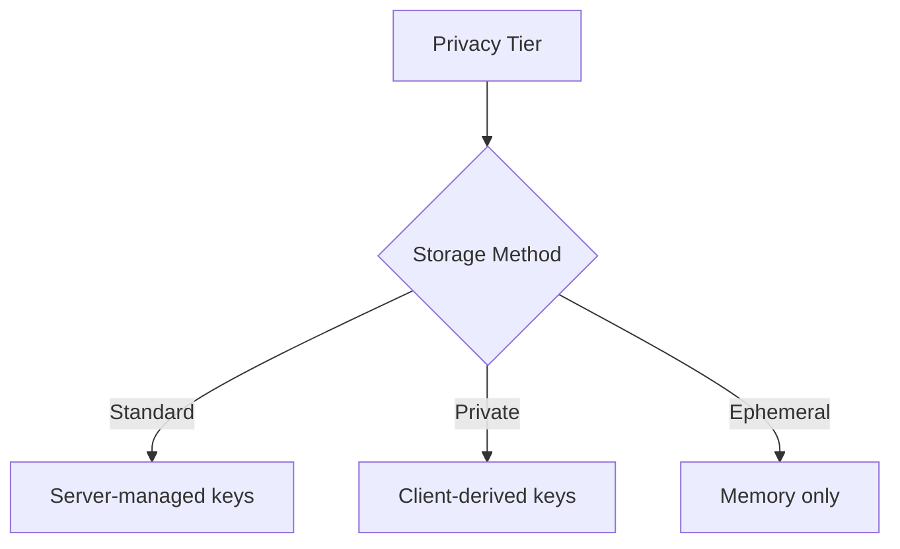

# Privacy Design Specification

## Privacy Tiers

### 1. Standard Tier
- **Authentication**: Password/OAuth
- **Data Storage**: Server-managed AES-256 keys
- **LLM Providers**: Any provider
- **Recoverability**: Full account recovery
- **Use Case**: General conversations where convenience is prioritized

### 2. Private Tier
- **Authentication**: Password + storage passphrase
- **Data Storage**: Client-derived keys (passphrase never sent to server)
- **LLM Providers**: On-prem only (Ollama/Local)
- **Recoverability**: Passphrase-dependent
- **Use Case**: Sensitive topics requiring zero-knowledge storage

### 3. Ephemeral Tier
- **Authentication**: None
- **Data Storage**: Memory-only (no disk writes)
- **LLM Providers**: Free or on-prem providers
- **Recoverability**: None
- **Use Case**: Anonymous temporary conversations

## Implementation Details

### Provider Restrictions
| Provider Type | Standard | Private | Ephemeral |
|---------------|----------|---------|-----------|
| On-prem       | ✅       | ✅      | ✅        |
| Free cloud    | ✅       | ❌      | ✅        |
| Paid cloud    | ✅       | ❌      | ❌        |

### Storage Mechanisms

### Security Properties
- **Standard**: Protects against storage theft but allows server access
- **Private**: True zero-knowledge storage (server cannot access data)
- **Ephemeral**: No persistent data = maximum session privacy

### UI Elements
- Privacy tier selector dropdown
- Dynamic LLM provider filtering
- Storage passphrase manager (Private tier)
- Session timeout warnings (Ephemeral tier)
