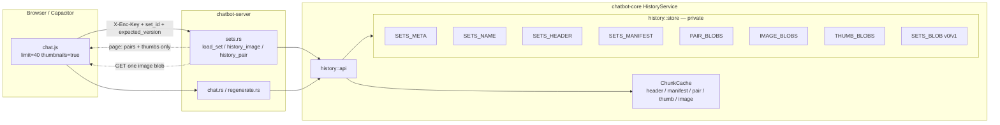
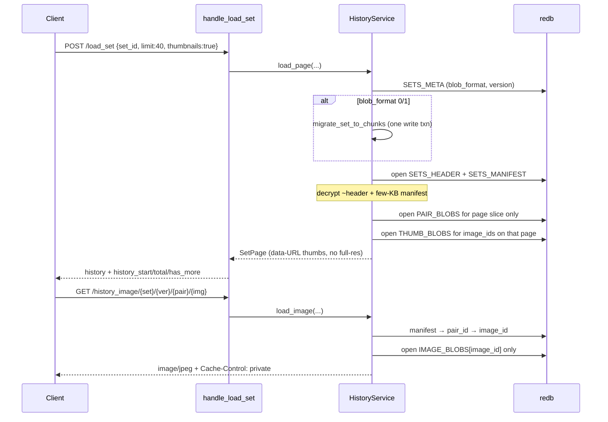
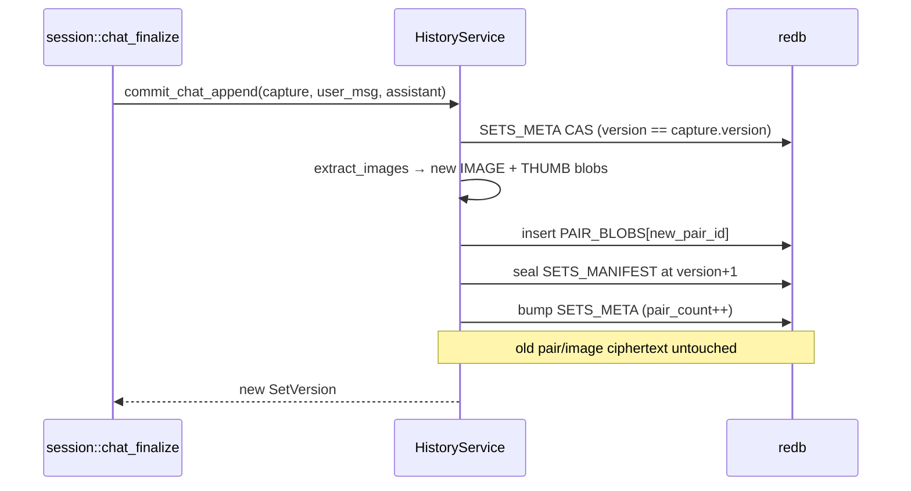
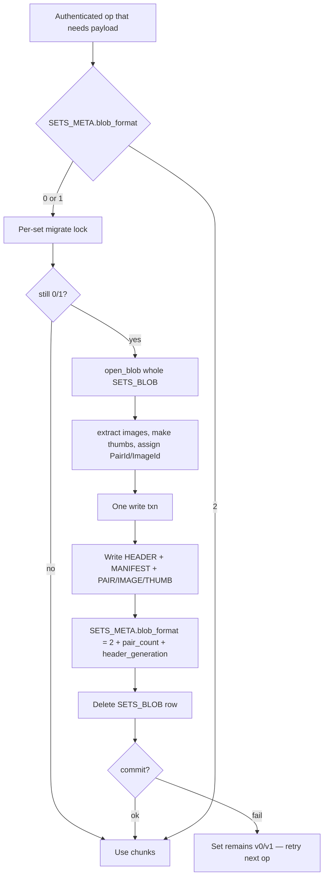

# Chunked / Lazy-Loadable History Blobs

| Field | Value |
| :--- | :--- |
| **Author** | TBD |
| **Date** | 2026-08-14 |
| **Status** | Draft |
| **Related** | [design.md](/workspace/chatbot-rust/docs/design.md), [design-privacy.md](/workspace/chatbot-rust/docs/design-privacy.md), [design-history-store.md](/workspace/chatbot-rust/docs/design-history-store.md) |
| **Primary crates** | `chatbot-core`, `chatbot-server` |
| **Supersedes (partial)** | Phase 1 whole-set `SETS_BLOB` in `docs/design-history-store.md` (“Future: split `SETS_BLOB`…”). Phase 1 public API names, CAS, `PrepareCapture`, `SETS_NAME`, guests-RAM-only, and HTTP contracts stay. |

---

## Overview

Authenticated history is durable as one AEAD ciphertext per set (`SETS_BLOB`). That was the right Phase 1 cutover, but it is now the remaining cost center for long image-heavy chats: every `load_snapshot` / `commit_snapshot` decrypts or re-seals the **entire** `SetPayloadV1` (name + memory + prompt + all pairs, including full-resolution `[IMAGE:data:...]` attachments). UI paging (`/load_set?limit=&thumbnails=`), `GET /history_image/...`, and `POST /history_pair` already hide that cost from the wire — they still pay it on the server.

This design splits each set into a **small sealed header**, a **small sealed manifest**, **per-pair ciphertext**, and **extracted image / thumbnail blobs**. Decrypt CPU and write AEAD become proportional to the data actually touched. Set CAS `version` stays on `SETS_META` and is **not** bound into unchanged chunk AAD (that would reintroduce full re-encrypt). HTTP contracts stay compatible. Existing redb files migrate **in place, per set, lazily, in one write transaction**.

---

## Background & Motivation

### Current architecture (Phase 1 — implemented)

| Layer | Location | Behavior |
| :--- | :--- | :--- |
| Durable store | `chatbot-core/src/history/store/` | `{HOST_DATA_DIR}/history/redb`: one `SETS_BLOB` row per `set_id` |
| Crypto | `history/crypto.rs` | AES-256-GCM + HKDF; AAD `user_id \|\| set_id \|\| blob_kind \|\| version` (`build_aad`) |
| Payload | `SetPayloadV1` in `history/types.rs` | JSON: `display_name`, `memory`, `system_prompt`, `history: Vec<(String,String)>` |
| Cache | `history/cache.rs` `SetCache` | **Full decrypted `SetSnapshot`** (incl. all image bytes), 256 sets, TTL 1h |
| Names | `SETS_NAME` | Sealed display names; `list_sets` does not open `SETS_BLOB` |
| UI projection | `sets.rs` `handle_load_set` | `page_history` + `replace_images_with_ui_thumbnails` **after** full decrypt |
| Image GET | `handle_history_image` | Full decrypt, then `nth_image_data_url` + `decode_image_data_url` |
| Chat prepare | `session.rs` | `PrepareCapture::from_snapshot` clones the full history into the stream task |
| Model packing | `chat.rs` / `chat_images.rs` | Downscales older images for the **outbound prompt only**; durable store keeps full fidelity |

`SETS_BLOB` is documented as temporary:

```10:13:chatbot-core/src/history/store/tables.rs
/// set_id (16 bytes) → whole-set history ciphertext (memory, prompt, all pairs).
///
/// Future: split into per-pair chunks so load/decrypt can be lazy per message
/// instead of opening the entire set.
```

And `docs/design-history-store.md`:

> Future: split `SETS_BLOB` into individual sealed chunks per message pair so load/decrypt can be lazy (page a tail of pairs without opening the whole set). Keep `HistoryService` method names; pair rows stay ciphertext with AAD bound to `user_id|set_id|pair_index` (or pair id). Not started.

The parenthetical “or pair id” is the correct fork — this design **rejects `pair_index` in AAD** (see Key Decisions).

### What still decrypts / re-seals the entire set

| Path | Function | Cost |
| :--- | :--- | :--- |
| Any load | `RedbHistoryStore::load_snapshot` | `open_blob` of whole `SETS_BLOB` |
| Any write | `RedbHistoryStore::commit_snapshot` | `seal_blob` of entire `SetPayloadV1` at `expected.next()` |
| Mutations | `HistoryService::{append_pair,delete_pair,commit_chat_append,commit_regenerate,update_memory,update_system_prompt,rename_set,reset_history}` | `load_snapshot_cached` + `commit_snapshot`. Cache hit skips decrypt; **every write still re-seals multi-MB JSON** |
| `/load_set` | `sets.rs` `handle_load_set` | Full snapshot, then `page_history` + optional JPEG thumbs |
| `/history_image` | `handle_history_image` | Full snapshot to extract one image |
| `/history_pair` | `handle_history_pair` | Full snapshot for one pair |
| Chat / regenerate | `session.rs` prepare | Clones full history (full-res images) into `PrepareCapture` |

AAD binds **set `version`**. Every CAS bump must re-encrypt the whole payload even when older pairs/images are unchanged (`crypto.rs` `build_aad` / `seal_payload_v1`).

### Image model (why granularity matters)

User messages embed attachments as `[IMAGE:data:image/...;base64,...]` (`chat_images.rs`). Caps:

- `MAX_MESSAGE_CHARS = 5 MiB` per side (`history/ops.rs`) — matches `/chat` body
- `MAX_HISTORY_PAIRS = 2000`
- UI page: `DEFAULT_HISTORY_PAGE_SIZE = 40`, `MAX_HISTORY_PAGE_SIZE = 200`
- Model: `MAX_FULL_RES_IMAGES = 1`; older images become 256px JPEG for the **prompt only**
- UI thumbs: 384px / q70, computed **on read** today (`replace_images_with_ui_thumbnails`)

A 50-image chat is tens of MB of base64 inside one JSON object. AES-GCM + `serde_json` on that blob is the CPU burn. A “per-pair chunk” that still inlines 5 MiB of base64 does **not** fix `/history_image` or thumbnail CPU.

### Privacy constraints (non-negotiable)

From `docs/design-privacy.md` and `docs/design-history-store.md`:

- Strict Private Mode: client-derived key, per-request `X-Enc-Key`, server never persists the data key
- Ciphertext at rest; set names are sensitive (not plaintext filenames or unencrypted index keys)
- AAD must prevent cut-and-paste of ciphertext across users / sets / kinds
- Guests remain RAM-only (no redb)
- Single-node Docker, one writer process
- Narrow `HistoryService` API; redb/crypto sealed inside `history::store`
- Do not log plaintext history, keys, or display names at info

### Invariants that must be preserved

- Every mutation names `set_id`; CAS on monotonic set `version` → HTTP 409 `version_conflict`
- `PrepareCapture` is immutable; finalize commits from capture only
- Client already sends `set_id` + `expected_version`; 409 applies `current_version` and retries
- Delete matches user text with image payloads stripped (`chat_images::user_messages_match`) so UI thumbs still locate the stored pair
- Regenerate/edit coalesces a shorter incoming image payload back to stored full-res unless the client removed the attachment (`coalesce_edit_user_message`)
- `/load_set` pagination + `thumbnails` + `/history_image` + `/history_pair` HTTP contracts stay compatible
- Existing redb files (`data/history/redb`) migrate in place with no operator step
- Tests via `./scripts/run-tests.sh` only; agents must not rebuild the live stack
- No cache-busting query params on script tags

---

## Goals & Non-Goals

### Goals

1. **Decrypt CPU ∝ bytes actually needed** — a page of pairs, one image, one pair for edit — not the whole set.
2. **Writes do not re-encrypt unchanged older pairs or images.**
3. **Network stays small** — keep (and make cheaper) thumbnail/paging; do not force the client to download full-res images or the entire history to render the tail.
4. **First load after process restart** of a long image-heavy set paints the recent page without waiting for full-set AEAD (after the set has been migrated; see migration).
5. Keep `HistoryService` as the only public entry. Handlers do not touch redb.
6. In-place, idempotent, one-txn-per-set migration. Dual-read of `blob_format` 0/1 forever until the set is touched.
7. Incremental, independently mergeable PRs.

### Non-Goals

- Changing client key derivation / IndexedDB / WebAuthn wrapping
- Recoverable Mode / OAuth
- Multi-writer / multi-instance redb
- Full-text search or server-side history query language
- Guest/ephemeral RAM history (stays inlined `Vec<(String,String)>`)
- Compressing blobs or changing `MAX_MESSAGE_CHARS` / `MAX_HISTORY_PAIRS`
- Forcing a client protocol break (`img:` refs must not leak onto the wire)
- Rewriting `SETS_NAME` / `list_sets` (already isolated)
- Computing vision-prompt thumbs as a **second durable size**. Older-image model context downscales the 384px durable UI thumb to 256px **in RAM only** (today’s `prepare_history_images` behavior) so packing/token estimates stay unchanged.

---

## Key Decisions

1. **Chunk granularity = per-pair text + extracted image blobs + write-time UI thumbnails.**  
   Images dominate payload. Per-pair-only (images still inline) does not fix `/history_image` or thumb CPU. Size-capped multi-pair pages add complexity without helping once images are extracted (text pairs are typically ≪ 1 KB).

2. **Stable IDs in keys/AAD; `pair_index` remains the HTTP/UI address.**  
   `delete_pair` today is `Vec::remove` (`ops.rs`). Binding AAD to `pair_index` would re-seal every later pair on delete. Pair/image IDs are UUID v4, never reused. Manifest maps logical order → ids.

3. **Unchanged chunk AAD is *not* bound to set `version`.**  
   Bind `user_id|set_id|blob_kind|stable_id` (+ pair `generation` for in-place edit). Set `version` stays on `SETS_META` for CAS. Binding chunks to version is how Phase 1 re-encrypts everything.

4. **Sealed header (memory + system_prompt) is independent of pair/image chunks.**  
   `update_memory` / `update_system_prompt` re-seal only the header. `rename_set` touches only `SETS_NAME` (+ CAS meta / manifest rewrite). `SETS_NAME` remains the SoT for display names.

5. **Sealed manifest, AAD-bound to set `version` (u64, same encoding as `build_aad`).**  
   The ordered id list is rewritten on every mutation anyway and is a few KB even at 2000 pairs. Binding it to `version` makes CAS tamper-evident (stale manifest will not open under the new version). Do **not** put display names or message previews in the manifest. `pair_count` on `SETS_META` is a **write-only hint** for metrics; `history_total` is always `manifest.pairs.len()`. Mime and sizes live inside sealed payloads.

6. **Durable JPEG thumbnails at write time (384px / q70), not on read.**  
   Read-time thumbs (today) require decrypting full-res just to paint `/load_set?thumbnails=true`. Write-time: pay one resize when the pixels are already in RAM; store ~15–40 KB/image; page loads decrypt thumbs only. **No second durable size.** On the **model path only**, downscale those 384px thumbs in RAM to 256px / q55 so `THUMB_DATA_URL_LEN_HINT` / token estimates match today’s packing.

7. **Images/thumbs sealed as a binary plaintext, not JSON.**  
   Layout: `mime_len:u16 le || mime utf8 || raw_bytes`, then existing `nonce(12) || ciphertext+tag`. Ban `serde_json` for `IMAGE_BLOBS` / `THUMB_BLOBS` (default `Vec<u8>` would be a JSON int array and destroy the ~33% win). Header / manifest / pair stay JSON.

8. **Internal pair text uses `[IMAGE:img:<uuid>]` refs (hyphenated lowercase). HTTP never sees them.**  
   `load()` / `load_snapshot` **materialize `data:` URLs** so existing **read** handlers and `prepare_chat_messages` stay correct across incremental PRs. **Every format-2 write** goes through `load_logical()` (refs + `pair_ids`) and **normalizes to refs before compare and seal** — `PAIR_BLOBS` never persist `data:` URLs. Extract converts **only** valid `data:` URLs on **new** image slots; unknown tags stay opaque text. Materialize miss → `[IMAGE:unavailable]` (still matches via `strip_image_payloads`), never `img:` on the wire.

9. **`PrepareCapture` stops holding full-res image bytes (after the slim-prepare PR).**  
   Capture keeps header fields, version, `pair_ids`, and pair **text with refs**. `HistoryService::prepare_capture` materializes `ChatContext.history` **once** (1 full-res + in-RAM 256px thumbs) and leaves `chat.rs` `prepare_chat_messages` unchanged — no second resize pass, no `HistoryService` inside that pure function. Coalesce resolves stored image ids.

10. **Migrate on first authenticated payload op (read or write), not on `list_sets`.**  
    One write txn: split → write chunks → set `blob_format = 2` → delete `SETS_BLOB`. Unmigrated sets remain readable. First **any** payload op (`/load_set`, `/chat`, `/history_image`, …) of a large set spikes once. `HistoryService` takes the per-set migrate lock **once** around ensure-chunked; store helpers do not lock. Lock order: `name_mutation_locks` (user) → `migrate_locks` (set_id).

11. **Additive redb schema (`SCHEMA_VERSION = 2`) + `BlobFormat::AeadChunkedV2 = 2`.**  
    New tables; do not overload `SETS_BLOB`. `init_schema` **must** read `META["schema"]` and bump any stored byte `< 2` → `2` while opening new tables (today it only inserts if the key is missing). Per-set `blob_format` is the dual-read discriminator. **`SetMetaValue` keeps the old exact-length encode for `blob_format` 0/1**; the 8-byte suffix is written only on format-2 rows so a previous image can still decode meta until the first format-2 write.

12. **Handlers gain `HistoryService::{load_page, load_pair, load_image}`; they never open redb.**  
    `load()` stays a **materializing** compatibility API (full-res data URLs) until those handlers and slim prepare land. After that, handlers must not call `load()` for paging/images. `load_logical()` is the ref-shaped internal read.

13. **No feature flag.** Dual-read of v0/v1 is the compatibility valve. Rollback: previous image can open any row that is still exact-length `blob_format` 0/1. The **first format-2 write** (`create_set` after the migrator PR, or first per-set migrate) makes that set unreadable to old code — restore `data/history/redb` from a volume snapshot.

14. **Cache header + manifest + recently used pair/thumb/image chunks, version-checked against meta.**  
    Stop storing a full `SetSnapshot` with image bytes as the primary cache entry.

15. **`commit_snapshot` diffs by `PairId` and compares **ref-normalized** text.**  
    Every format-2 write normalizes incoming pair text to `[IMAGE:img:…]` **before** “did this pair change?” and **before** seal. Occupied image slots reuse `manifest.image_ids[i]` (a `data:` URL in that slot is a materialized thumb, not a new attachment). New `ImageId`s only for tags beyond the stored slot list, or for a brand-new pair. `ops::*` keep `pair_ids` aligned with `history` (append pushes a new id; delete/reset drop ids). From **PR 5**, mutations call `load_logical()`, not materializing `load()`.

---

## Proposed Design

### High-level architecture



### Read / write data flow





### Module layout (delta on Phase 1)

```
chatbot-core/src/history/
  api.rs                 # + load_page / load_pair / load_image; chunk-aware mutations
  cache.rs               # replace full-snapshot cache with ChunkCache
  crypto.rs              # typed AAD helpers + binary image/thumb seal/open
  types.rs               # + BlobFormat::AeadChunkedV2, PairId, ImageId, SetSnapshot.pair_ids, ManifestV1, HeaderV1
  ops.rs                 # keep pair_ids aligned; durable format-2 writes normalize to refs at commit
  images.rs              # NEW (or extend chat_images.rs): extract refs, materialize, miss policy
  store/
    tables.rs            # + SETS_HEADER, SETS_MANIFEST, PAIR_BLOBS, IMAGE_BLOBS, THUMB_BLOBS
    keys.rs              # + chunk_key(set_id, id), set_chunk_prefix, chunk_prefix_end
    mod.rs               # dual-read, migrate_set, incremental commits
    migrate_set.rs       # NEW: v1 blob → chunks in one txn
  migration.rs           # unchanged (sets.json → redb); chunk migrate is per-set inside store
```

Visibility unchanged: `history::store::*` stays crate-private. Handlers import only `HistoryService` + types.

### Identity: `pair_index` vs stable ids

| ID | Sensitivity | Where | Role |
| :--- | :--- | :--- | :--- |
| `set_id` | Non-sensitive UUID | keys, HTTP, logs | Set identity (unchanged) |
| `version` | Non-sensitive u64 | `SETS_META`, HTTP CAS | Set-wide CAS |
| `pair_index` | Non-sensitive usize | HTTP / UI only | Address into current logical order |
| `PairId` | Non-sensitive UUID | keys, AAD, manifest | Stable pair identity |
| `ImageId` | Non-sensitive UUID | keys, AAD, pair payload | Stable image identity |
| `pair_generation` | Non-sensitive u32 | AAD + manifest | In-place edit of a pair |
| `header_generation` | Non-sensitive u32 | AAD + `SETS_META` | Memory/prompt edits |
| `display_name` | **Sensitive** | `SETS_NAME` only | Never in manifest / meta / keys |

`pair_index` is **computed** as the position of `PairId` in `ManifestV1.pairs`. After `delete_pair`, later HTTP indices shift (same as today’s `Vec::remove`); ciphertext keys do not.

---

## Data Model Changes

### redb tables

Single DB file remains `{HOST_DATA_DIR}/history/redb`. `SCHEMA_VERSION` bumps **1 → 2**. **Required `init_schema` change:** today (`store/mod.rs`) the schema byte is written **only if `META["schema"]` is missing**. The new `init_schema` must `open` every table (redb create is additive), **read** the stored byte, and overwrite it with `2` when it is missing or `< 2`. Existing set **payload** rows are not rewritten at schema bump.

```text
// Existing (unchanged keys)
SETS_META:     set_id[16]              -> SetMetaValue
SETS_BLOB:     set_id[16]              -> whole-set ciphertext   // v0/v1 only; deleted after migrate
SETS_NAME:     set_id[16]              -> sealed { display_name }
USER_SETS:     (user, set_id)          -> updated_at u64
META:          &str                    -> bytes

// New
SETS_HEADER:   set_id[16]              -> sealed HeaderV1
SETS_MANIFEST: set_id[16]              -> sealed ManifestV1
PAIR_BLOBS:    chunk_key(set, Pair, id)   -> sealed PairPayloadV1
IMAGE_BLOBS:   chunk_key(set, Image, id)  -> sealed ImagePayloadV1
THUMB_BLOBS:   chunk_key(set, Thumb, id)  -> sealed ThumbPayloadV1
```

**Composite chunk key** (`keys.rs`): tables are already kind-separated, so the key does **not** include `ChunkKind` (kind belongs in AAD). Same exclusive-end pattern as `user_sets_prefix_end`:

```rust
/// set_id (16) || id (16)  — 32 bytes, range-scanable by set.
pub fn chunk_key(set_id: SetId, id: Uuid) -> [u8; 32] { /* ... */ }

pub fn set_chunk_prefix(set_id: SetId) -> [u8; 16] { *set_id.as_bytes() }

/// Exclusive end bound for a range over one set’s chunk keys (increment set_id).
pub fn chunk_prefix_end(set_id: SetId) -> Option<[u8; 16]> { /* same carry as user_sets_prefix_end */ }
```

Do **not** put pair/image rows in `SETS_BLOB`. That table’s key is `set_id` only; overloading it would break v1 reads and `test_remove_history_blob`.

`delete_set` / `reset_history` range-delete each of `PAIR_BLOBS` / `IMAGE_BLOBS` / `THUMB_BLOBS` with `set_chunk_prefix .. chunk_prefix_end`.

### `SetMetaValue` (suffix only on format 2)

Current encoding is exact-length (`tables.rs` `decode` requires `bytes.len() == need`). New decoder accepts an **optional** 8-byte suffix; **encoder writes the suffix only when `blob_format == AeadChunkedV2`**. v0/v1 writes (including `create_set` / `commit_snapshot` until the migrator PR) keep the old exact-length bytes so a previous image’s decoder still works.

```text
user_len:u16 | user_utf8 | version:u64 | created_at:u64 | updated_at:u64
| is_default:u8 | blob_format:u8
| [format 2 only] header_generation:u32 le | pair_count:u32 le
```

- `blob_format` 0/1 rows: exact `2+user+8+8+8+2` bytes; `header_generation = 0`; `pair_count` unknown
- `blob_format` 2 rows: always include the suffix
- `blob_format`: `0` FernetLegacy, `1` AeadV1, **`2` AeadChunkedV2**

```rust
pub enum BlobFormat {
    FernetLegacy = 0,
    AeadV1 = 1,
    AeadChunkedV2 = 2,
}
```

`pair_count` is **not** a source of truth. Write it on every successful format-2 mutation (metrics / debug). `load_page` always sets `history_total` from `manifest.pairs.len()`. A meta `pair_count == 0` may skip opening pair blobs when the manifest is also empty.

### Plaintext payloads

```rust
pub struct HeaderV1 {
    pub memory: String,
    pub system_prompt: String,
}

pub struct ManifestV1 {
    pub pairs: Vec<ManifestPair>,
}

pub struct ManifestPair {
    pub pair_id: PairId,          // Uuid
    pub generation: u32,
    pub image_ids: Vec<ImageId>,  // ordered; matches [IMAGE:img:…] tags
}

pub struct PairPayloadV1 {
    pub user: String,             // [IMAGE:img:<uuid>] refs, never data: URLs
    pub assistant: String,
}

pub struct ImagePayloadV1 {
    pub mime: String,             // e.g. "image/jpeg" — sealed, not plaintext meta
    pub bytes: Vec<u8>,           // raw decoded bytes
}

pub struct ThumbPayloadV1 {
    pub mime: String,             // "image/jpeg" when encode succeeds; else original mime
    pub bytes: Vec<u8>,
}
```

Header / manifest / pair plaintext is `serde_json`. **Image and thumb plaintext is not JSON.**

```text
// ImagePayloadV1 / ThumbPayloadV1 on disk, before AEAD:
//   mime_len: u16 le | mime: utf8 | raw_bytes: [u8]
// then existing framing: nonce(12) || ciphertext+tag
```

`serde_json` is banned for `IMAGE_BLOBS` / `THUMB_BLOBS`. A fixture JPEG’s sealed blob length must be `≈ 12 + 16 + 2 + mime.len() + raw.len()` (nonce + GCM tag + binary plaintext), not a JSON array of integers. Crypto/store test asserts this.

**What is allowed where**

| Field | SETS_META (plaintext) | Sealed manifest | Sealed pair/image |
| :--- | :---: | :---: | :---: |
| pair count | yes | yes (len) | — |
| ordered pair/image UUIDs | no | yes | yes |
| `has_image` / image count | no (redundant) | implicit via `image_ids` | — |
| byte sizes | no | no (avoid traffic analysis extras) | implicit ciphertext len |
| image mime | **no** | no | yes |
| display name / previews | **no** | **no** | no (name stays in `SETS_NAME`) |
| message text / pixels | **no** | **no** | yes |

Ciphertext length of `IMAGE_BLOBS` already leaks approximate image size to a disk thief; we do not add more size fields in plaintext.

### AAD construction

Keep `build_aad` / `build_name_aad` for v1. **Do not** share a single `build_chunk_aad(..., generation: Option<u32>)` — manifest binds a **u64** `SetVersion` (8-byte LE, same as `build_aad`), while header/pair bind a **u32**. A shared `u32` would silently truncate versions `> 2^32−1`.

```rust
/// user || 0xff || set_id || 0xff || b"set_header_v1" || 0xff || header_generation:u32 le
pub fn build_header_aad(user_id: &str, set_id: SetId, header_generation: u32) -> Vec<u8>;

/// user || 0xff || set_id || 0xff || b"set_manifest_v1" || 0xff || version:u64 le
/// (same version encoding as `build_aad`)
pub fn build_manifest_aad(user_id: &str, set_id: SetId, version: SetVersion) -> Vec<u8>;

/// user || 0xff || set_id || 0xff || b"set_pair_v1" || 0xff || pair_id || 0xff || generation:u32 le
pub fn build_pair_aad(user_id: &str, set_id: SetId, pair_id: PairId, generation: u32) -> Vec<u8>;

/// user || 0xff || set_id || 0xff || b"set_image_v1" || 0xff || image_id
pub fn build_image_aad(user_id: &str, set_id: SetId, image_id: ImageId) -> Vec<u8>;

/// user || 0xff || set_id || 0xff || b"set_thumb_v1" || 0xff || image_id
pub fn build_thumb_aad(user_id: &str, set_id: SetId, image_id: ImageId) -> Vec<u8>;
```

| Blob | `kind` string | Bound id | Bound generation |
| :--- | :--- | :--- | :--- |
| Header | `set_header_v1` | — | `header_generation` **u32** |
| Manifest | `set_manifest_v1` | — | set `version` **u64 LE** |
| Pair | `set_pair_v1` | `pair_id` | `pair_generation` **u32** |
| Image | `set_image_v1` | `image_id` | — (images are immutable) |
| Thumb | `set_thumb_v1` | `image_id` | — |
| Name | `set_name_v1` | — | — (unchanged) |
| Legacy payload | `set_payload_v1` | — | set `version` (unchanged) |

Test: a manifest sealed at `SetVersion(1u64 << 32 | 1)` opens only with that exact `u64`, not with a truncated `u32`.

HKDF info stays `chatbot-set-payload-v1` (`crypto.rs`). Domain separation is AAD `kind`, not a new key. Framing stays `nonce(12) || ciphertext+tag`.

**Why images have no generation:** a caption edit keeps the same `ImageId` and does not rewrite `IMAGE_BLOBS`. Replacing an attachment allocates a new `ImageId` and deletes the old image+thumb in the same txn. This avoids re-encrypting megabytes on a text-only edit.

**Cut-and-paste:** a pair blob from set A cannot open under set B (`set_id` in AAD). A thumb blob cannot open as an image (`kind`). A generation-N pair cannot open as N+1 after edit.

### Cache

Replace `SetCache`’s primary `DashMap<(user, SetId), CachedPlain>` (full `SetSnapshot`) with a layered cache:

| Map | Key | Value | Capacity (process-wide) |
| :--- | :--- | :--- | :--- |
| summaries | `(user, set_id)` | name + version + is_default | 256 (unchanged) |
| headers | `(user, set_id)` | `HeaderV1` + `header_generation` + set version | 256 |
| manifests | `(user, set_id)` | `ManifestV1` + set version | 256 |
| pairs | `(user, set_id, pair_id, gen)` | `PairPayloadV1` | 256 entries **or** 16 MiB, LRU |
| thumbs | `(user, set_id, image_id)` | JPEG bytes + mime | 256 entries **or** 8 MiB |
| images | `(user, set_id, image_id)` | raw bytes + mime | **8** entries **or** 32 MiB |

Invalidation:

- Any CAS success for a set: drop that set’s header/manifest if their generation/version changed; drop deleted pair/image keys; keep untouched pair/image entries
- Version mismatch vs `SETS_META`: treat as miss (same as today)
- TTL 1h (same constant)

`list_sets` continues to use summaries + `SETS_NAME` only.

Do **not** put a reconstructed full-res `SetSnapshot` in cache. From PR 5, if `SetCache` still holds a `SetSnapshot`, it is **logical** (refs + `pair_ids`). `load()` materializes a copy for readers only. `prepare_capture` (PR 8) caches header + manifest + pair texts (refs). `load_image` may cache the one full-res blob.

### `SetSnapshot` / `PrepareCapture`

`SetSnapshot` carries **both** the logical pair texts and the aligned `pair_ids` (same length). That is how `commit_snapshot` and `PrepareCapture::from_snapshot` know which `PairId` is which — position matching alone is not enough.

Two read shapes (do not conflate them):

| Method | History strings | `pair_ids` | Who may call |
| :--- | :--- | :--- | :--- |
| `load()` / `load_snapshot` | **Materialized `data:` URLs** (compat) | populated on format 2 | Existing handlers, tests, name shim — **until** those callers switch |
| `load_logical()` | `[IMAGE:img:<uuid>]` refs, no pixels | populated | Mutations, slim `prepare_capture`, `load_page` internals |

```rust
pub struct SetSnapshot {
    pub set_id: SetId,
    pub version: SetVersion,
    pub display_name: String,
    pub memory: String,
    pub system_prompt: String,
    pub history: Vec<HistoryPair>,
    /// Aligned with `history`. Empty on pre-chunk fixtures; format-2 loads always fill it.
    pub pair_ids: Vec<PairId>,
    pub is_default: bool,
}

pub struct SetPage {
    pub set_id: SetId,
    pub version: SetVersion,
    pub display_name: String,
    pub memory: String,
    pub system_prompt: String,
    pub is_default: bool,
    pub history: Vec<HistoryPair>, // page only; thumbs materialized if requested
    pub history_start: usize,
    pub history_total: usize,      // always manifest.pairs.len()
    pub has_more: bool,
}

pub struct PrepareCapture {
    pub set_id: SetId,
    pub version: SetVersion,
    pub memory: String,
    pub system_prompt: String,
    pub display_name: String,
    pub is_default: bool,
    /// Logical pair texts with `[IMAGE:img:…]` refs — no pixel bytes.
    pub history: Vec<HistoryPair>,
    /// Copied from `SetSnapshot.pair_ids` (same length as `history`).
    pub pair_ids: Vec<PairId>,
    pub insertion_index: Option<usize>,
    pub replace_user_message: Option<String>,
}
```

`PrepareCapture::from_snapshot` copies `pair_ids`. After the slim-prepare PR, chat prepare **must** build the capture from `load_logical()`, not from a materialized `load()`.

**Model path — materialize once, leave `prepare_chat_messages` pure.**  
`chat.rs` `prepare_chat_messages` (`chat.rs:133`) is a pure function over `ChatContext.history` and has no `HistoryService`. Do **not** teach it `img:` refs.

`HistoryService::prepare_capture` (called from `session.rs`) does:

1. `load_logical()` — refs only, no image bytes in the capture
2. Build `ChatContext.history` by walking newest→oldest: one `load_image_by_id` (crate-private) for the remaining `MAX_FULL_RES_IMAGES` slot; every older `[IMAGE:img:<id>]` becomes an **in-RAM** 256px / q55 JPEG from the durable 384px thumb (not the 384px data URL)
3. Hand those already-thumbnail-sized strings to `prepare_chat_messages` **unchanged** — no second `prepare_history_images` resize

`load_image_by_id(user, set_id, image_id, key)` is crate-private on the store / service. Public `load_image` stays `(pair_index, image_index)` for HTTP.

Token estimates: 256px q55 stays under `THUMB_DATA_URL_LEN_HINT` (48_000) / 12 KB, so older images keep `THUMB_IMAGE_TOKEN_ESTIMATE = 200`. Add a `chat.rs` test that a 384px durable thumb, after the RAM downscale, does not flip to `FULL_IMAGE_TOKEN_ESTIMATE`.

Regenerate coalesce (`session.rs` ~1271):

```text
stored  = capture.history[idx].user          // "[IMAGE:img:<uuid>]"
incoming = request.message                   // thumb data URL or new full-res
effective = coalesce_edit_user_message_refs(incoming, stored)
```

New helper (next to `coalesce_edit_user_message`):

- Structural match (`user_messages_match`) + incoming payloads shorter or `data:` → **keep stored `img:` refs**
- Incoming removed images → drop refs (and commit will delete those image/thumb rows)
- Incoming has extra / replacement `data:` that is not a thumb of a stored id → new `ImageId`s

Finalize then writes only the affected pair (+ any new image/thumb rows).

---

## API / Interface Changes

### `HistoryService` (additive)

Existing method names stay. Internals become chunk-aware. New methods for handlers:

```rust
impl HistoryService {
    /// Paged load. Decrypts header + manifest + the requested pair window
    /// (+ thumbs if `thumbnails`). Never opens IMAGE_BLOBS.
    pub fn load_page(
        &self,
        user: &str,
        set_id: SetId,
        key: &EncryptionKey,
        limit: Option<usize>,
        before: Option<usize>,
        thumbnails: bool,
    ) -> Result<SetPage, HistoryError>;

    /// One logical pair, full fidelity (data URLs inlined from IMAGE_BLOBS).
    pub fn load_pair(
        &self,
        user: &str,
        set_id: SetId,
        pair_index: usize,
        key: &EncryptionKey,
    ) -> Result<(SetVersion, HistoryPair), HistoryError>;

    /// One attachment. Decrypts manifest + that IMAGE_BLOB only.
    pub fn load_image(
        &self,
        user: &str,
        set_id: SetId,
        pair_index: usize,
        image_index: usize,
        key: &EncryptionKey,
    ) -> Result<(String /* mime */, Vec<u8>), HistoryError>;

    /// Compat load: header + all pairs with **data: URLs materialized**.
    /// Existing handlers may keep calling this until they switch to load_page.
    /// Expensive on image-heavy sets — `tracing::warn` when image_count > 0.
    pub fn load(...) -> Result<SetSnapshot, HistoryError>;

    /// Ref-shaped load: pair texts contain `[IMAGE:img:<uuid>]`, `pair_ids` filled.
    /// Mutations and slim prepare use this. Not a handler API.
    pub fn load_logical(...) -> Result<SetSnapshot, HistoryError>;
}

// crate-private (store / HistoryService)
fn load_image_by_id(...) -> Result<(String, Vec<u8>), HistoryError>;
```

`history_total` on `SetPage` is `manifest.pairs.len()`, never plaintext `pair_count`.

### Format-2 write path (required from PR 5)

Today every mutation is `load_snapshot_cached` → `ops::*` → `store.commit_snapshot` (`api.rs`). Materializing `load()` is **read-only compat**. It is **not** a safe input to format-2 `commit_snapshot`:

- `ops::append_pair` / `delete_pair` / `reset_history` today only touch `history`, not `pair_ids` → after migrate, `pair_ids.len() != history.len()` → Rule 2 `InvalidInput`, **or**
- If Rule 2 is waived, incoming `data:` URLs look like every pair changed → new `ImageId`s for every attachment, `data:` persisted into `PAIR_BLOBS`, `update_memory` / `rename_set` rewrite all image ciphertext.

**From the first commit that can flip `blob_format` (PR 5), all production mutations must:**

1. `ensure_chunked` then **`load_logical()`** (refs + aligned `pair_ids`). Do **not** feed `load()` / a materialized `SetCache` entry into `ops::*` or `commit_snapshot`.
2. `SetCache` (until the PR 8 redesign) stores **logical** snapshots only. `load()` materializes a **copy** for the HTTP/chat caller and never writes `data:` text back into the cache.
3. `ops::*` keep `pair_ids.len() == history.len()`:
   - `append_pair` / `apply_chat_append`: `pair_ids.push(PairId::new())`
   - `delete_pair`: `pair_ids.remove(pair_index)` with `history`
   - `reset_history`: `pair_ids.clear()`
   - `update_memory` / `update_system_prompt` / `rename` / `apply_regenerate`: clone/`idx` replace leaves `pair_ids` unchanged
4. Incoming client strings that still contain `data:` (new chat turn, edit) are passed through `normalize_pair_for_commit` **inside** `commit_snapshot` / the incremental writer — not left as raw `data:` in `PAIR_BLOBS`.

### `commit_snapshot` diff rules

`commit_snapshot` remains the generic fallback (and the **only** format-2 writer until PR 6). It **must** follow these rules:

1. Load current `SETS_META` (CAS) + sealed manifest. Manifest `PairId`s are the identity set.
2. Require `snapshot.pair_ids.len() == snapshot.history.len()` on format 2. Missing / wrong-length ids → `InvalidInput`.
3. **Normalize every incoming pair to refs before compare and before seal.** Never persist `data:` in `PAIR_BLOBS`.

```text
normalize_pair_for_commit(incoming_user, stored_image_ids: &[ImageId]) -> (ref_text, image_ids, new_blobs)
  for each [IMAGE:…] tag at slot i (left→right):
    if i < stored_image_ids.len():
      reuse stored_image_ids[i]          // data: in an occupied slot is a thumb, not a new image
      emit [IMAGE:img:<that-uuid>]
    else if tag is data: / bare-base64:
      allocate ImageId, extract bytes + thumb, emit [IMAGE:img:<new>]
    else:
      leave opaque text (including [IMAGE:unavailable])
  drop stored_image_ids[i..] (deleted slots) in the same txn
```

   New pair (`PairId` not in the manifest): `stored_image_ids` is empty → every `data:` tag is extracted.

4. **Match by `PairId`, never by index + raw materialized text.**
   - id in both incoming and manifest → same pair. Compare **ref-normalized** user/assistant to the stored `PairPayloadV1`. Re-seal only if those strings differ (`generation++`). `update_memory` / `rename` therefore leave pair/image ciphertext bit-identical.
   - id in incoming only → append/insert: new pair row, extract `data:` only.
   - id in manifest only → delete that pair row and its image/thumb rows.
5. `ops::apply_chat_append` / `apply_regenerate` stay **pure** helpers. They must preserve `pair_ids` (step 3 above). Production finalize after PR 6 may extract at the service layer; until then, `commit_snapshot` + `normalize_pair_for_commit` is what keeps PR 5 writes correct.

Hot paths:

| Method | Opens | Writes |
| :--- | :--- | :--- |
| `append_pair` / `commit_chat_append` | meta + manifest | 1 pair + N images + N thumbs + new manifest + meta |
| `delete_pair` | meta + manifest + 1 pair (content match) | delete pair/images/thumbs, new manifest + meta |
| `reset_history` | meta | range-delete pair/image/thumb, empty manifest + meta |
| `update_memory` / `update_system_prompt` | meta + header | header (`header_generation++`) + manifest (version AAD) + meta |
| `rename_set` | meta + name | `SETS_NAME` + manifest (version AAD) + meta |
| `commit_regenerate` | meta + manifest + 1 pair (+ images if replaced) | that pair (`generation++`) + optional new images + manifest + meta |
| `delete_set` | meta | all rows for `set_id` including chunk prefix |

`rename_set` today (`api.rs` ~384–398) `load_snapshot_cached` + `commit_snapshot` — that re-seals the whole history just to change the name. After this design it must not touch `PAIR_BLOBS` / `IMAGE_BLOBS`.

### HTTP (compatible)

No path or JSON field changes required.

| Endpoint | Today | After |
| :--- | :--- | :--- |
| `POST /load_set` | `history.load` + slice + optional live thumbs | `history.load_page` |
| `POST /history_pair` | `history.load` + index | `history.load_pair` (or `load_image` when `image_index` set) |
| `GET /history_image/{set}/{ver}/{pair}/{img}` | `history.load` + extract | `history.load_image`. Path `version` remains a **browser cache key only** (already documented in `handle_history_image`) |
| `POST /chat`, `/regenerate`, `/delete_message`, … | unchanged contracts | chunk-aware `HistoryService` |

`limit = None` still returns the full logical history (legacy tests in `load_set_history.rs`). That path decrypts all **pair** chunks (and full-res images if `thumbnails` is false). The shipped UI always sends `limit: 40` and `thumbnails: true` (`static/chat.js` `HISTORY_PAGE_SIZE`).

**Wire invariant:** HTTP JSON and HTML never contain the substring `[IMAGE:img:`. `load_page` / `load_pair` / `load()` materialize or placeholder; they do not pass refs through. Integration test after migrate: `/load_set` body has no `img:`, and `/chat` still sends one real full-res image to the model.

### Image tag rewrite (`chat_images.rs`)

Keep `IMAGE_TAG_PREFIX = "[IMAGE:"`.

```rust
pub const IMAGE_REF_PREFIX: &str = "img:"; // payload after "[IMAGE:"

/// Canonical ImageId in tags: hyphenated lowercase UUID
/// e.g. [IMAGE:img:550e8400-e29b-41d4-a716-446655440000]
pub fn extract_images_from_user_message(text: &str) -> Result<(String, Vec<ExtractedImage>), OpsError>;
pub fn materialize_thumbs(text: &str, thumbs: &HashMap<ImageId, Vec<u8>>) -> String;
pub fn materialize_full(text: &str, images: &HashMap<ImageId, (String, Vec<u8>)>) -> String;
```

**Extract rules**

- Convert **only** well-formed `data:` / bare-base64 image payloads. Those become `[IMAGE:img:<hyphenated-lowercase-uuid>]` plus an `ExtractedImage`.
- Unknown / non-UUID / non-`data:` payloads stay **opaque text** inside the pair (not looked up, not stored as blobs). A user who typed `[IMAGE:cat]` keeps that string.
- Write-time thumb: `thumbnail_payload_with(..., UI_THUMB_MAX_EDGE=384, UI_THUMB_JPEG_QUALITY=70)`.
- **Thumb encode failure** (decode/resize/JPEG): do **not** fail the commit or the whole-set migrate. Store a copy of the original decoded bytes as the thumb payload (original mime), increment tracing counter `history_thumb_fallback`. If the `data:` payload itself cannot be decoded, leave the original tag as opaque text (no image/thumb row).

**Materialize miss policy** (missing `THUMB_BLOBS` / `IMAGE_BLOBS`, dangling id, unknown `img:`):

- Replace that tag with `[IMAGE:unavailable]`.
- **Never** emit `[IMAGE:img:…]` into HTTP JSON, SSE, or `ChatContext.history` destined for a provider.

`user_messages_match` / `strip_image_payloads` need **no change** — they already drop the payload between `[IMAGE:` and `]`. `[IMAGE:unavailable]` and `[IMAGE:img:<uuid>]` both strip to `[IMAGE]`, so a client that echoes the paged user text on `POST /delete_message` still matches the stored pair. Do **not** use `[image unavailable]` (no `[IMAGE:` prefix) — that would 409 `content mismatch`.

---

## Migration

### Per-set, lazy, one transaction



Rules:

1. **Trigger:** first authenticated **payload** op — `load` / `load_logical` / `load_page` / `load_pair` / `load_image` / any content mutation / `/chat` prepare. **Not** `list_sets` (does not open `SETS_BLOB`). First `/chat` or `GET /history_image` after upgrade also pays the spike, not only `/load_set`.
2. **Lock scope (no self-deadlock):** `std::sync::Mutex` is not reentrant (`name_mutation_locks` / `migration_locks` today). Store helpers (`load_*`, `commit_*`, `migrate_set`) **must not** take the per-set lock. `HistoryService` exposes `ensure_chunked(user, set_id, key)` that acquires `migrate_locks[set_id]`, re-checks `blob_format`, migrates if needed, **releases**, then returns. Callers that already hold `name_mutation_locks` (rename/create) call `ensure_chunked` **after** that user lock. **Lock order: `name_mutation_locks` (user) → `migrate_locks` (set_id), never the reverse.** A mutation is then a normal CAS write without holding the migrate lock. Two threads that both see v1 serialize on the set lock; the second rechecks and no-ops.
3. **Do not hold `migrate_locks` for other sets.** Decrypt of an 80 MB v1 blob happens under that set’s lock only.
4. **Atomic:** all new rows + meta flip + `SETS_BLOB` delete in **one** `begin_write`. Failure leaves the set entirely on v0/v1.
5. **Never half-migrated:** readers that see `blob_format != 2` only look at `SETS_BLOB`. Readers that see `2` only look at chunk tables.
6. **Keep loading unmigrated sets** for as long as they exist.
7. **`create_set` / import write format:** see PR Plan. **PR 4 keeps every production write on v1** (format-2 path is test-only). **PR 5** (migrator) flips `create_set` + `import_sets_and_mark_migrated` + first payload migrate to format 2. PR 9 deletes leftover v1 write branches.
8. **No operator step.** Same spirit as the redb v2→v3 file-format upgrade in `RedbHistoryStore::open`.
9. **First payload op of a large set spikes once** (CPU + peak RAM/disk — see estimates). Log `history_chunk_migrate` with `set_id`, `pair_count`, `image_count`, `src_bytes`, `elapsed_ms` — no names, no plaintext.

Why not migrate-on-write-only: a user who only browses a 50-image archive would keep paying full-set AEAD on every process restart. That violates goal 4.

Why not a background job: no standing `X-Enc-Key`; we cannot decrypt idle sets.

### `create_set` / import after the migrator PR (PR 5+)

`create_set` writes `blob_format = 2`, empty `ManifestV1`, sealed `HeaderV1` (empty memory + default prompt), `SETS_NAME`, **no** `SETS_BLOB` row, `SetMetaValue` **with** the 8-byte suffix. `import_sets_and_mark_migrated` writes format 2 directly (no second split). `load_snapshot` on a format-2 set must not require `SETS_BLOB`. Until PR 5, both stay on v1 exact-length meta + `SETS_BLOB`.

### Rollback

| Situation | Previous image |
| :--- | :--- |
| PR 3 deployed (schema byte 2, new tables exist); all sets still `blob_format` 0/1 with **exact-length** meta | **Works.** Old `SetMetaValue::decode` still accepts those rows. Unknown tables are ignored. |
| First format-2 **create_set** or first per-set **migrate** (PR 5+) | That set has suffix meta + chunk tables; old decoder returns “corrupt set meta” / cannot open `blob_format = 2` |
| Need to roll back after any format-2 write | Restore `data/history/redb` from a **pre-format-2-write** volume snapshot + previous image |

Do **not** claim “old image works if no heavy set is opened”: an empty `create_set` after PR 5 is enough to write unreadable meta. Snapshot before deploying PR 5. No automatic “re-merge to v1” writer.

---

## Alternatives Considered

### 1. Per-pair chunks with images still inline

- **Pros:** Smaller schema; one blob kind; migration is “split the JSON array”.
- **Cons:** A single pair can still be 5 MiB of base64. `/history_image` and `/load_set?thumbnails=true` still decrypt and JPEG-decode that pair. Write of an unrelated pair is cheap, but the dominant image cost remains.
- **Decision:** Rejected as insufficient for the stated CPU/`/history_image` goals.

### 2. Size-capped multi-pair pages (e.g. 256 KiB windows)

- **Pros:** Fewer keys; sequential tail load is one decrypt.
- **Cons:** Delete/regenerate in the middle rewrites a page; pages that contain one image are still huge unless images are extracted (at which point per-pair text is already tiny); `pair_index` mapping becomes page+offset bookkeeping.
- **Decision:** Rejected. After image extraction, per-pair is the natural grain.

### 3. Content-addressed image store (key = hash of plaintext bytes)

- **Pros:** Dedup identical attachments across pairs/sets.
- **Cons:** Hash-as-key either leaks a content fingerprint in plaintext keys or requires a sealed map anyway; AAD still needs `user_id|set_id` so cross-set dedup fights cut-and-paste binding; little benefit on a single-user self-host.
- **Decision:** Rejected. Random `ImageId` + immutable blob is enough.

### 4. Compute thumbs on read; RAM-cache only

- **Pros:** Zero extra durable bytes.
- **Cons:** First `/load_set?thumbnails=true` after restart decrypts every full-res image on the page (the current pain). Cache is gone on process restart — exactly when the UI is cold.
- **Decision:** Rejected. Write-time durable thumbs are the point of goal 4.

### 5. Bind chunk AAD to set `version` (Phase 1 style)

- **Pros:** Familiar; stale chunk under a new version fails closed.
- **Cons:** Every CAS bump re-encrypts every chunk — the bug we are fixing.
- **Decision:** Rejected for pair/image/thumb/header. Accepted **only** for the tiny manifest (must be rewritten for CAS integrity).

### 6. Bind AAD to `pair_index`

- **Pros:** Matches the HTTP address; no manifest.
- **Cons:** `delete_pair` shifts indices (`ops::delete_pair` → `Vec::remove`) and would re-seal all later pairs (and their images if AAD includes index).
- **Decision:** Rejected. Stable ids + manifest.

---

## Security & Privacy Considerations

| Threat | Mitigation |
| :--- | :--- |
| Disk theft | All content still AEAD; names only in `SETS_NAME`; manifest has ids/order only |
| Ciphertext swap across users/sets/kinds | Chunk AAD binds `user_id\|set_id\|kind\|id` |
| Swap a pair into another index of the same set | Manifest (version-bound) is the only order; opening the pair blob still succeeds (same set) but CAS version changes on any reorder — attacker with write to redb already owns the node |
| Roll back memory independently of history | `header_generation` in AAD + meta |
| Roll back pair list to hide/restore messages | Manifest AAD includes set `version`; meta CAS is SoT |
| Paste an image blob as a thumb | Distinct `kind` in AAD |
| `/history_image` without key | Unchanged: 401 unless `X-Enc-Key` or Path-scoped `hist_enc_key` cookie |
| Session cookie theft | Unchanged per-request key model |
| Logging | Log `set_id`, `pair_id`, `image_id`, versions, byte lengths, elapsed; never names, keys, plaintext |
| Cache RAM dump | Process-local plaintext of **recent** chunks only (narrower than today’s full-set cache). Still discarded on restart |
| Guest data | Still RAM-only; no chunk tables |
| AuthZ | Every op still checks `SETS_META.user_id` before opening any chunk |

**Key zeroization:** unchanged (`EncryptionKey` + request scope).

**Do not** log `hist_enc_key` or `X-Enc-Key` (already forbidden in `design-privacy.md`).

---

## Observability

| Signal | Implementation |
| :--- | :--- |
| Per-set migrate | `tracing::info` `history_chunk_migrate` — `set_id`, `pair_count`, `image_count`, `src_bytes`, `elapsed_ms` |
| Chunk open | debug span `history.chunk_open` — `kind`, `bytes` |
| Commit | debug span `history.commit` — `op` (`append`/`delete_pair`/`memory`/…), `chunks_written`, `chunks_deleted` |
| Full assemble | `tracing::warn` if `load()` materializes full-res for a set with `image_count > 0` (catches handler regressions after PR 7) |
| CAS | existing `history_cas_conflict` |
| Thumb fallback | `tracing::info` `history_thumb_fallback` — `set_id`, `image_id` (no bytes) |
| Metrics | **No Prometheus crate in this workspace** (only in-process rate-limit counters). Ship **tracing events** first (`history_chunk_migrate`, `history_chunk_open`, `history_commit`, `history_thumb_fallback`). Prometheus `history_chunk_decrypts{kind}` etc. are an optional follow-up, not part of this design. |

Alerting (single-node): migrate failures looping on one `set_id`; disk growth on `data/`; p99 `/load_set` after migrate should drop, not rise. Soak a 50-image fixture and watch client/proxy timeouts on the first payload op (1–5 s + I/O).

### Latency / storage estimates

Assumptions: local SSD, AES-GCM ~1–2 GB/s, typical phone JPEG 1.5–3 MB decoded, 40-pair UI page, 8 images on that page.

| Op | Today (cold, 50-image / ~80 MB JSON) | Target after migrate |
| :--- | :--- | :--- |
| `/load_set?limit=40&thumbnails=true` | Decrypt 80 MB + JSON + 8× JPEG resize | Decrypt header+manifest (~1–50 KB) + 40 pairs (~40 KB) + 8 thumbs (~200 KB). **p99 < 100 ms** |
| `GET /history_image` | Decrypt 80 MB to emit ~2 MB | Decrypt ~2 MB image blob. **p99 < 50 ms + I/O** |
| `append_pair` (1 new 2 MB photo) | Re-seal 80 MB+ | Seal 1 pair + 1 image + 1 thumb + few-KB manifest. **≪ TTFT** |
| `update_memory` | Re-seal 80 MB | Re-seal header (≤ 900 KB) + manifest |
| `rename_set` | Re-seal 80 MB | Re-seal name + manifest |
| First **any** payload op that migrates an 80 MB set (`/load_set`, `/chat`, `/history_image`, …) | n/a | **1–5 s once** (AES-GCM + JSON parse + re-seal + JPEG thumbs). Can trip client/proxy timeouts — soak a 50-image fixture. |

**Peak cost during the one-txn split** (old `SETS_BLOB` is kept until commit):

| Resource | Peak |
| :--- | :--- |
| Disk | old JSON ciphertext **+** new raw images + thumbs ≈ **~1.75×** the v1 blob until redb reclaims pages |
| RAM | decrypted ~80 MB JSON **plus** all newly sealed chunk buffers (order of the same magnitude) |

Storage after reclaim: raw image bytes ≈ 0.75× the old base64 JSON. Thumbs add ~15–40 KB × image count (≪ 1% for photo chats). Manifest ≈ `2000 × 40 B ≈ 80 KB` plaintext before AEAD.

`SetCache` today can hold 256 full snapshots — a few heavy sets already threaten process RSS. Chunk cache caps full-res images at 8 / 32 MiB.

---

## Rollout Plan

1. Land PRs 1–N in order (see **PR Plan**). PRs 1–4 keep **all production writes on v1** and do not trigger migrate; existing handlers stay correct. PR 5 enables migrate + format-2 `create_set` / import; `load()` still **materializes `data:` URLs** for **reads**; **mutations switch to `load_logical()` + ref-normalized `commit_snapshot` in the same PR**. PRs 6–8 are the latency win (incremental writes that skip untouched chunks more cheaply, `load_page`, slim prepare).
2. **No config flag.** Dual-read is the compatibility switch.
3. Deploy single `webserver` (user rebuilds the live stack on the host; agents do not).
4. Soak: watch `history_chunk_migrate` events and `/load_set` latency. `list_sets` must not emit migrate events. Include a 50-image fixture for first-op timeout behavior.
5. **Rollback:** previous image can read exact-length v0/v1 meta after PRs 1–4. After PR 5, snapshot `data/history/redb` before deploy; any format-2 write needs that snapshot to roll back.
6. Docs: update `docs/design-history-store.md` (status + this design as Phase 2), tick the lazy-load bullet in `docs/design.md` to note durable chunks.
7. Tests: `./scripts/run-tests.sh` only.

### Risks

| Risk | Severity | Mitigation |
| :--- | :--- | :--- |
| Half-migrated set | **High** | Single write txn; format bit flipped with blob delete |
| `PrepareCapture` without pixels breaks coalesce | **High** | Ref-aware coalesce + tests ported from `chat_images.rs` / `load_set_history.rs` |
| Handler still calls `load()` and materializes full-res | **High** | `warn` on full-res assemble; `load_page` / `load_image` are the only handler paths |
| Schema decode of old `SETS_META` breaks | **High** | Optional trailing fields; exact-length old rows still decode |
| First payload-op migrate spikes `/load_set` **and** `/chat` / `/history_image` | Medium | Once per set; log duration; soak timeouts; UI already waits on first unlock |
| Rollback after first format-2 write | Medium | Exact-length v1 encode until format 2; snapshot before PR 5 |
| Self-deadlock on migrate + `name_mutation_locks` | Medium | Lock only in `ensure_chunked`; order user → set |
| Manifest version-bind means every op re-seals it | Low | Manifest is KB, not MB |
| Header re-seal of 900 KB memory on prompt edit | Low | Still far below whole-set rewrite; append does not touch header |
| Orphan chunks if delete misses a prefix | Medium | Range-delete by `set_id` prefix; store tests for reset/delete_set |
| Test hook `test_remove_history_blob` | Low | Keep for v1; add `test_remove_pair_blob` for format 2 |
| Guest path regression | Low | Guests never enter `HistoryService` chunk code |

---

## Test Plan

Follow AGENTS.md: new behavior → tests first; `./scripts/run-tests.sh`; do not delete existing tests.

### New unit tests

- `crypto.rs`: seal/open header, manifest, pair, image, thumb; reject wrong user / set / kind / id / generation; name blob still does not open as pair; **manifest sealed at `SetVersion((1u64 << 32) + 1)` opens only with that u64**; **fixture JPEG sealed length ≈ `12+16+2+mime+raw`** (not a JSON int array)
- `chat_images.rs`: `extract_images_from_user_message` round-trip with **hyphenated lowercase** UUIDs; `user_messages_match` thumb vs `img:` ref vs full data URL; coalesce keeps `img:` ids when incoming is a shorter data URL; coalesce honors removal; extract leaves `[IMAGE:cat]` opaque; materialize miss emits `[IMAGE:unavailable]`, never `img:`; `user_messages_match("hello\n[IMAGE:img:…]", "hello\n[IMAGE:unavailable]")`
- `chat.rs`: after RAM 256px downscale of a 384px durable thumb, `approximate_content_tokens` stays in the thumb bucket (`< THUMB_DATA_URL_LEN_HINT`)
- `ops.rs`: existing snapshot tests stay; `append_pair` / `delete_pair` / `reset_history` keep `pair_ids` aligned with `history`

### New store tests (`store/mod.rs` / `migrate_set.rs`)

- **Migrate:** seed v1 `SETS_BLOB` with mixed text + fixture JPEGs → first `load_page` → `blob_format == 2`, `SETS_BLOB` absent, history/images intact, display name still in `SETS_NAME`
- **Idempotent migrate:** second load does not rewrite pair ciphertext (compare raw `PAIR_BLOBS` bytes)
- **Append does not rewrite old ciphertext:** capture pair/image blob bytes, append, assert old keys’ values are bit-identical
- **Page decrypts only needed chunks:** test counter / hook on `aead_open`; `load_page(limit=2, thumbnails=true)` on a 10-pair / 10-image set opens 1 header + 1 manifest + 2 pairs + 2 thumbs, **0** `IMAGE_BLOBS`
- **`load_image` one blob:** opens manifest + 1 image, not other images
- **Delete pair:** later pairs’ ciphertext unchanged; `pair_index` 0 now addresses the former index 1; deleted image/thumb keys gone
- **Reset:** pair/image/thumb prefix empty; header memory preserved
- **Memory/rename:** pair/image bytes unchanged
- **CAS:** stale append still `Conflict`; concurrent append: one winner
- **Unmigrated still loads:** v1 set never opened for write remains `blob_format = 1` and `load_snapshot` works
- **Failed migrate:** inject error before commit (if practical) → still v1
- **Privacy:** display name still absent from raw redb bytes
- **create_set (after PR 5):** no `SETS_BLOB` row; meta has suffix
- **create_set (PR 4):** still v1 `SETS_BLOB` + exact-length meta (old decoder accepts)
- **Dangling image id:** `load_page` / `load_pair` JSON does not contain `img:`
- **`commit_snapshot` reuse:** logical snapshot with existing `pair_ids` + `img:` refs does not rewrite `IMAGE_BLOBS` bytes
- **PR 5 write safety:** migrate a 2-image set, `update_memory`, assert `PAIR_BLOBS` / `IMAGE_BLOBS` ciphertext is bit-identical; `append_pair` adds one pair/image and does not rewrite the two old image blobs
- **Delete after miss:** delete the thumb row, `load_page`, `delete_pair` with the echoed page text (`[IMAGE:unavailable]`) succeeds

### Keep existing integration tests

- `chatbot-server/tests/load_set_history.rs` — paging, thumbs, `/history_pair`, `/history_image`, delete-by-thumb
- `history_robustness.rs` — CAS, capture, multi-set
- `sets.rs`, `memory.rs`, `enc_key_auth.rs`, regenerate/delete/chat suites
- `static_assets.rs` — `/history_image` URL + `hist_enc_key` cookie

Add integration tests:

- Seed a large-ish fixture via `HistoryService`, restart-equivalent `HistoryService::open_ephemeral` on the same file, `POST /load_set` with `limit`+`thumbnails`, assert response size ≪ stored full-res and `GET /history_image` still returns JPEG SOI.
- After migrate, `/load_set` and `/history_pair` JSON **never** contain `img:`; `/chat` still sends one real full-res `data:image/…` to the stub provider.

---

## Open Questions

These are the only product-level forks left; everything else is decided above.

1. **Eventually reject `limit = None` on `/load_set` for authed clients?**  
   Recommendation: **keep** for tests and old clients. UI already pages. Revisit only if a client still requests full history with `thumbnails: false` in production logs.

Format-2 `create_set` / `sets.json` import, image framing, AAD widths, migrate-on-first-payload-op, `load()` materialize-until-switched, and thumb-miss policy are decided above (not TBD).

---

## References

- [`docs/design-history-store.md`](/workspace/chatbot-rust/docs/design-history-store.md) — Phase 1 redb + `HistoryService` (Implemented)
- [`docs/design-privacy.md`](/workspace/chatbot-rust/docs/design-privacy.md) — Strict Private Mode, per-request `X-Enc-Key`
- [`docs/design.md`](/workspace/chatbot-rust/docs/design.md) — UI lazy-load already shipped; durable store still whole-set
- [`chatbot-core/src/history/store/mod.rs`](/workspace/chatbot-rust/chatbot-core/src/history/store/mod.rs) — `load_snapshot` / `commit_snapshot`
- [`chatbot-core/src/history/store/tables.rs`](/workspace/chatbot-rust/chatbot-core/src/history/store/tables.rs) — `SETS_BLOB` comment, `SCHEMA_VERSION = 1`
- [`chatbot-core/src/history/crypto.rs`](/workspace/chatbot-rust/chatbot-core/src/history/crypto.rs) — `build_aad` version binding
- [`chatbot-core/src/history/api.rs`](/workspace/chatbot-rust/chatbot-core/src/history/api.rs) — public mutations all funnel through `commit_snapshot`
- [`chatbot-core/src/history/cache.rs`](/workspace/chatbot-rust/chatbot-core/src/history/cache.rs) — full-snapshot `SetCache`
- [`chatbot-core/src/history/ops.rs`](/workspace/chatbot-rust/chatbot-core/src/history/ops.rs) — `delete_pair` index shift, `page_history`, size caps
- [`chatbot-core/src/chat_images.rs`](/workspace/chatbot-rust/chatbot-core/src/chat_images.rs) — `[IMAGE:]` tags, thumbs, coalesce
- [`chatbot-server/src/sets.rs`](/workspace/chatbot-rust/chatbot-server/src/sets.rs) — `handle_load_set` / `handle_history_image` / `handle_history_pair`
- [`static/chat.js`](/workspace/chatbot-rust/static/chat.js) — `HISTORY_PAGE_SIZE = 40`, `thumbnails: true`, `historyImageUrl`
- [`chatbot-server/tests/load_set_history.rs`](/workspace/chatbot-rust/chatbot-server/tests/load_set_history.rs) — HTTP contract tests
- AGENTS.md — Docker tests via `./scripts/run-tests.sh`; no live-stack rebuild; commit only

---

## PR Plan

Incremental, independently reviewable PRs. Each PR should add tests first where behavior changes (AGENTS.md bug protocol) and pass `./scripts/run-tests.sh`. Do not rebuild the live `webserver` from the agent sandbox.

**Compat rules that make PRs 5+ mergeable:**

- **Reads:** `load()` / `load_snapshot` **always materialize `data:` URLs** on format-2 sets so existing `handle_load_set` / `handle_history_image` / `prepare_chat_messages` keep working. HTTP JSON must never contain `img:`.
- **Writes:** from the first PR that can persist `blob_format = 2` (PR 5), mutations call **`load_logical()`** and `commit_snapshot` **normalizes to refs** (slot-aligned `ImageId` reuse). `ops::*` keep `pair_ids` aligned. Materializing `load()` is never an input to a format-2 write.

### PR 1: Chunk domain types + typed AAD crypto (no redb wiring)

- **PR title:** `history: chunk types and typed AAD seal/open for header/pair/image`
- **Files/components:** `chatbot-core/src/history/types.rs` (`BlobFormat::AeadChunkedV2`, `PairId`, `ImageId`, `HeaderV1`, `ManifestV1`, `PairPayloadV1`, `ImagePayloadV1`, `ThumbPayloadV1`, **`SetSnapshot.pair_ids`** defaulting to empty); `crypto.rs` (`build_header_aad`, `build_manifest_aad`, `build_pair_aad`, `build_image_aad`, `build_thumb_aad`, binary image/thumb seal); unit tests in `crypto.rs`
- **Dependencies on other PRs:** none
- **Description:** Add format discriminator, `SetSnapshot.pair_ids` (empty on v1 fixtures), and per-blob AAD helpers (manifest binds `SetVersion` u64; header/pair bind u32). Image/thumb plaintext is `mime_len || mime || bytes` — no `serde_json`. Tests: wrong-user/kind/id/generation fail; manifest at version `2^32+1` opens only with that u64; JPEG sealed length ≈ `12+16+2+mime+raw`. Do not change `seal_payload_v1`. No store/API/HTTP changes.

### PR 2: Image extract / materialize helpers + ref-aware coalesce

- **PR title:** `chat_images: extract img:uuid refs and coalesce against stored ids`
- **Files/components:** `chatbot-core/src/chat_images.rs` (and tests); optionally a thin `history/images.rs` facade
- **Dependencies on other PRs:** PR 1 (for `ImageId` type; can use `Uuid` if PR 1 is not merged yet — prefer PR 1 first)
- **Description:** Implement `extract_images_from_user_message` (hyphenated lowercase UUIDs; **only** `data:` URLs become refs; other tags stay opaque), write-time 384px thumb with **original-bytes fallback** on encode failure, `materialize_thumbs` / `materialize_full` (miss → `[IMAGE:unavailable]`, never `img:`), `normalize_pair_for_commit` (slot-reuse), and coalesce that keeps stored `img:` refs when the client sends a shorter data URL. Keep `user_messages_match`. No I/O. Also update `ops::*` so `append_pair` / `delete_pair` / `reset_history` / `apply_*` keep `pair_ids` aligned (safe no-op while the field is empty on v1).

### PR 3: redb tables, composite keys, schema v2, SetMeta suffix on format 2 only

- **PR title:** `history: schema v2 chunk tables and format-2-only SetMeta suffix`
- **Files/components:** `store/tables.rs`, `store/keys.rs` (`chunk_key`, `set_chunk_prefix`, `chunk_prefix_end`), `store/mod.rs` `init_schema`; tests that a v1 file opens, schema byte becomes 2, **exact-length v1 meta still decodes**, suffix is written only when `blob_format == 2`
- **Dependencies on other PRs:** PR 1
- **Description:** Create `SETS_HEADER`, `SETS_MANIFEST`, `PAIR_BLOBS`, `IMAGE_BLOBS`, `THUMB_BLOBS`. Change `init_schema` to **read** `META["schema"]` and bump `< 2` → `2` (today it only inserts if missing). `SetMetaValue` encode stays exact-length for v0/v1. **All production writes remain v1.** No payload migrate.

### PR 4: Dual-read store primitives (format-2 path test-only)

- **PR title:** `history: chunked load/commit primitives beside v1 SETS_BLOB`
- **Files/components:** `store/mod.rs` (`load_header`, `load_manifest`, `load_pair_blob`, `load_image_blob` / `load_image_by_id`, `load_thumb_blob`, `commit_chunks`); store unit tests with tempfile
- **Dependencies on other PRs:** PR 2, PR 3
- **Description:** Implement sealed header/manifest/pair/image/thumb read-write, `load_logical()`, and the `PairId` + **ref-normalized** `commit_snapshot` diff (`normalize_pair_for_commit`: occupied slots reuse `image_ids[i]`; never persist `data:`). **`create_set`, production `commit_snapshot`, and import stay on v1.** Format-2 create/load/commit is exercised only by store tests that write chunks directly. `load()` on a test-only format-2 row **materializes data URLs**; `load_logical()` returns refs. No HTTP changes. No migrate hook.

### PR 5: Lazy per-set v1→v2 migrator + flip new writes to format 2

- **PR title:** `history: lazy one-txn split of SETS_BLOB into chunks`
- **Files/components:** `store/migrate_set.rs`; `HistoryService::ensure_chunked` (per-set lock, order user → set); `api.rs` mutations switch to `load_logical()` after `ensure_chunked`; `create_set` + `import_sets_and_mark_migrated` write format 2; `SetCache` stores logical snapshots; tests (migrate, idempotent, unmigrated still loads, name not in file, `load()` strings have `data:` not `img:`, **migrate then `update_memory` leaves `PAIR_BLOBS`/`IMAGE_BLOBS` bytes unchanged**, append does not rewrite old image ciphertext)
- **Dependencies on other PRs:** PR 4
- **Description:** On first payload op, split `SetPayloadV1` into header + pairs + images + thumbs, assign stable ids, flip `blob_format`, delete `SETS_BLOB` in the same txn. `list_sets` does not migrate. `load()` **materializes** so existing **read** handlers stay correct. **Writes** use `load_logical()` + ref-normalized `commit_snapshot` (this PR, not deferred to PR 6) so `append_pair` / `update_memory` / `rename_set` cannot `InvalidInput` or re-id every image. Import writes format 2. Log `history_chunk_migrate`. Snapshot volume before deploying this PR.

### PR 6: Incremental mutations (append / delete / reset / memory / rename / regenerate)

- **PR title:** `history: CAS mutations that do not rewrite unchanged chunks`
- **Files/components:** `history/api.rs`, `store/mod.rs`; store + `api.rs` tests: append-does-not-rewrite-old-ciphertext, delete does not rewrite later pairs, memory/rename leave pair bytes intact, regenerate bumps only one pair generation, `commit_chat_append` extracts at commit (does not `apply_chat_append` + full `commit_snapshot`)
- **Dependencies on other PRs:** PR 5
- **Description:** Reimplement `append_pair`, `commit_chat_append`, `delete_pair`, `reset_history`, `update_memory`, `update_system_prompt`, `rename_set`, `commit_regenerate` as **incremental** chunk ops (header-only memory/rename; one new pair on append) using `load_logical` + `PairId` diff rules. PR 5 already made these calls **correct** via ref-normalized `commit_snapshot`; this PR makes them **cheap**. Keep method signatures. Preserve 409 CAS and content-match delete.

### PR 7: `load_page` / `load_pair` / `load_image` + wire HTTP handlers

- **PR title:** `sets: page and image GET decrypt only needed chunks`
- **Files/components:** `history/api.rs` (`load_page`, `load_pair`, `load_image`); `chatbot-server/src/sets.rs`; existing `load_set_history.rs`; new store test for open-count; integration test that HTTP JSON has no `img:`
- **Dependencies on other PRs:** PR 6
- **Description:** Handlers stop calling full `load()` for these three routes. `history_total` from `manifest.pairs.len()`. JSON/image HTTP contracts unchanged. `limit=None` still works via pair chunks. Warn if any handler path materializes all full-res images.

### PR 8: ChunkCache + slim PrepareCapture / one-shot model materialize

- **PR title:** `history: chunk cache and slim PrepareCapture without full-res RAM`
- **Files/components:** `history/cache.rs`; `history/types.rs` (`PrepareCapture.pair_ids` if not already copied from `SetSnapshot`); `session.rs` prepare/finalize; `api.rs` `prepare_capture` (materialize 1 full-res + in-RAM 256px thumbs into `ChatContext.history`); `chat.rs` test that token estimates stay in the thumb bucket — **do not** change `prepare_chat_messages` to load images
- **Dependencies on other PRs:** PR 7
- **Description:** Stop caching full `SetSnapshot` with pixels. Prepare clones pair **refs** only. Session builds provider history once; `prepare_chat_messages` stays pure. Coalesce uses PR 2 helpers. Guests unchanged.

### PR 9: Docs + leftover v1 write paths + test-only hooks

- **PR title:** `docs: history Phase 2 chunked blobs; remove leftover v1 writes`
- **Files/components:** `docs/design-history-store.md` (Phase 2 section, status), `docs/design.md` lazy-load bullet; `store/mod.rs` comments on `SETS_BLOB`; delete dead v1 write branches in `create_set` / import / `commit_snapshot` (reader stays); keep `test_remove_history_blob` for v1 fixtures
- **Dependencies on other PRs:** PR 5–8
- **Description:** Document operator rollback (volume snapshot **before PR 5**; first format-2 write is the compatibility cliff). Confirm no handler touches redb. Add format-2 test hooks for `list_sets_does_not_open_history_blob`-style tests.

### Suggested merge order

```text
PR1 → PR2 → PR3 → PR4 → PR5 → PR6 → PR7 → PR8 → PR9
         ↘ (PR2 can overlap PR3 after PR1)
```

PR 2 and PR 3 can proceed in parallel after PR 1 if `ImageId` is merged first. PR 5 is deploy-sensitive (first format-2 writes) **and** must ship the `load_logical()` mutation path — it is not read-only. PR 6 then makes those writes incremental (no generic snapshot assemble). PR 7 is the first user-visible **read** latency win for `/load_set` / `/history_image` on already-migrated sets.
