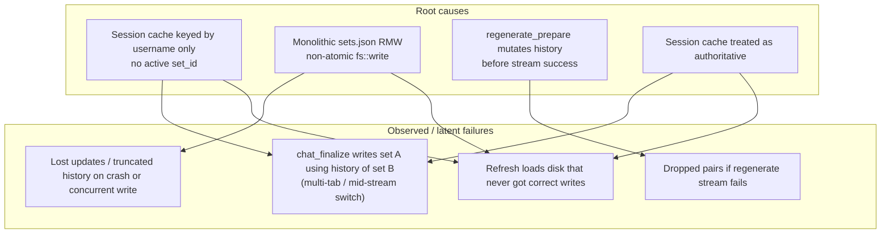
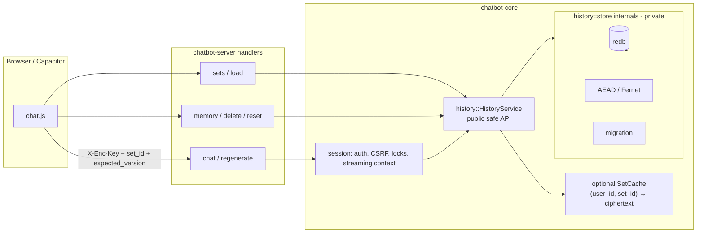
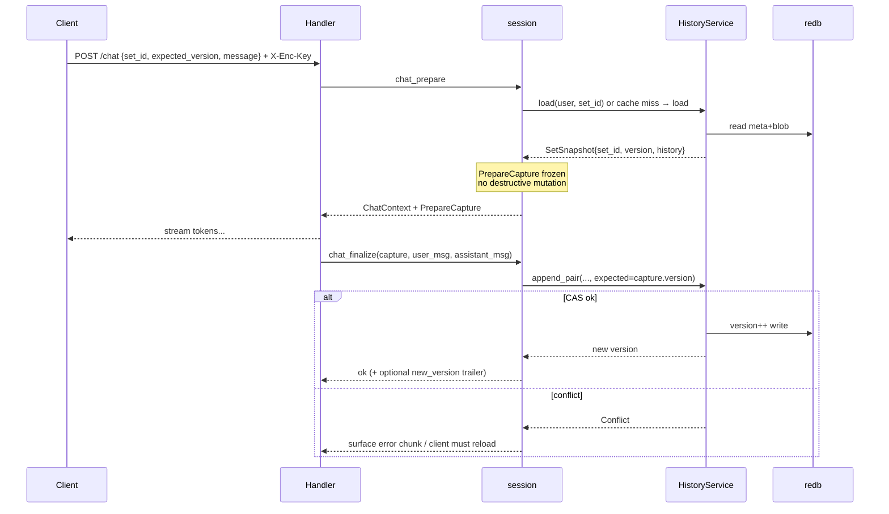
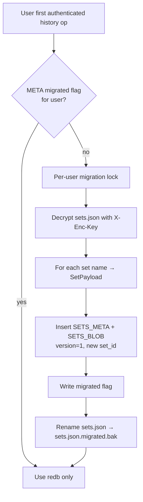

# Chat History Storage & Access Refactor (redb)

| Field | Value |
| :--- | :--- |
| **Author** | TBD |
| **Date** | 2026-07-09 |
| **Status** | **Implemented (cutover complete).** redb + `HistoryService`, AEAD+AAD, multi-set `history::cache::SetCache`, permanent `legacy_sets_json` module for pre-redb `sets.json` migration, `PrepareCapture` + CAS, client `set_id`/`expected_version` + 409 JSON/`version_conflict` reload UX. Live authed history RMW no longer uses `DataPersistence` (type alias to legacy seed/migration helpers only). |
| **Related** | [design.md](design.md), [design-privacy.md](design-privacy.md) |
| **Primary crates** | `chatbot-core`, `chatbot-server` |

---

## Overview

Production-like long sessions can lose a large fraction of chat history (~80% after refresh) even when the client UI still looks correct. Root causes were architectural: a session cache keyed only by username (no active `set_id`), non-atomic RMW of a monolithic encrypted `sets.json`, destructive mutations during regenerate prepare, and treating the in-RAM session cache as authoritative over durable storage.

This design replaces the file-backed `DataPersistence` history path with an embedded **redb** store of opaque AEAD ciphertext blobs plus non-sensitive structural metadata (`set_id`, version, timestamps, ownership). All durable history access goes through a narrow, invariant-enforcing API in `chatbot-core` (`history` module). Mutations are prepare/commit with CAS on version; conflicts return HTTP 409 and force client reload.

Phase 1 stores one whole-set encrypted payload per `set_id` (not per-message rows). Set display names live only inside ciphertext. Legacy `data/user_sets/{user}/sets.json` is migrated once into redb.

---

## Background & Motivation

### Current architecture (post cutover)

| Layer | Location | Behavior |
| :--- | :--- | :--- |
| Durable store | `chatbot-core/src/history/` (`HistoryService` + sealed redb) | `{HOST_DATA_DIR}/history/redb`: per-`set_id` AEAD ciphertext + meta (version, ownership, `is_default`); CAS on version |
| Multi-set cache | `history/cache.rs` (`SetCache`) | Process-local decrypted snapshots + list summaries keyed `(user_id, set_id)`, version-checked against redb meta; optional; never SoT. Avoids re-AEAD/JSON of multi-MB histories on warm `list_sets` / load / delete. |
| Migration format | `chatbot-core/src/legacy_sets_json/` (**permanent**) | Read/seed pre-redb `sets.json` (+ split-file legacy); orchestrated by `history/migration.rs` into redb; bak = `sets.json.migrated.bak` |
| Session | `session.rs` | Guest RAM history; authed session cipher stores `set_id` + memory/prompt only (not full history — redb is SoT). |
| Chat / regenerate | prepare/finalize + capture | Immutable `PrepareCapture`; CAS commit |
| Mutations | sets / memory / reset / delete | `set_id` preferred; `expected_version` for CAS; 409 `version_conflict` JSON |
| Client | `static/chat.js` | `activeSetPayload()` sends `set_id` + `expected_version`; 409 → toast + reload set, preserve draft |

**Operator cleanup:** After one stable redb release, optional delete of `data/user_sets/*/sets.json.migrated.bak`. Keep bak if you may roll back to an image without redb.

### Legacy architecture (pre-redb; fixed by this design)

| Layer | Location | Behavior |
| :--- | :--- | :--- |
| Durable store | `chatbot-core/src/persistence.rs` (`DataPersistence`) | Per-user `data/user_sets/{username}/sets.json`: entire map Fernet-encrypted as one blob; non-atomic `fs::write` |
| Session cache | `SessionStore` / `SessionData` | One entry per session; **no** `active_set_id`; treated as SoT |
| Chat path | finalize | Appended to RAM then `store_history` by `set_name` |
| Regenerate | prepare | **Removed** history pair before stream success |
| Load set | `replace_session_set` | Overwrote the single session blob |

Key call sites (legacy; migration helpers still reference some of these):

- `DataPersistence::store_history` / `load_set` / `write_sets` — [`chatbot-core/src/persistence.rs`](../chatbot-core/src/persistence.rs)
- `chat_prepare` / `chat_finalize` / `regenerate_*` / `replace_session_set` — [`chatbot-core/src/session.rs`](../chatbot-core/src/session.rs)
- Handlers: [`chatbot-server/src/chat.rs`](../chatbot-server/src/chat.rs), [`regenerate.rs`](../chatbot-server/src/regenerate.rs), [`memory.rs`](../chatbot-server/src/memory.rs), [`reset_chat.rs`](../chatbot-server/src/reset_chat.rs), [`sets.rs`](../chatbot-server/src/sets.rs)
- Client set switch: `static/chat.js` (`POST /load_set` on `#set-selector` change)

### Pain points (mapped to bug classes)



1. **Wrong-set write (primary long-session bug class)**  
   Session holds one history blob. Tab 1 streams in set α; Tab 2 `load_set`s β into the same session; Tab 1 `chat_finalize(set_name=α)` persists whatever is currently in RAM (β’s history + new pair) into α, or the inverse depending on timing. After refresh, large ranges of history appear “gone” because they were never correctly written under the expected set key—or were overwritten by another set’s content.

2. **Lost updates on monolithic RMW**  
   Every mutation decrypts the full user map, mutates one set, re-encrypts, and `fs::write`s the whole file. Concurrent mutations (two tabs, chat + delete, chat + memory) race; last writer wins. A crash mid-write can leave empty/corrupt file.

3. **Destructive prepare**  
   `build_regenerate_context` removes the pair at `pair_index` before the model stream completes. Failed/cancelled streams leave history permanently shorter until something reloads from disk—if disk was already partially updated, data is gone.

4. **Cache-as-authority**  
   Delete/edit/chat paths often read/write session history first and disk second. Disk is not the single source of truth; refresh exposes divergence.

### Why redb (decision; replaces design.md “Sled” item)

| Option | Verdict |
| :--- | :--- |
| Keep `sets.json` + file locks | Still one blob per user; hard to CAS per set; set names as map keys force decrypt to list |
| One file per set, name-based path | **Forbidden**: set names are sensitive; must not appear as plaintext filenames |
| SQLite | Relational features unused for opaque ciphertext; more ops surface for single-node |
| **Sled** (mentioned in design.md roadmap) | Unmaintained / not the chosen path |
| **redb** | Pure Rust, embedded, MVCC, ACID transactions, typed tables, active maintenance — fits opaque blob + metadata KV on single-node Docker deploy |

**Documented decision:** future concurrent storage work targets **redb**, not Sled. Implementation of this design should update `docs/design.md` (replace the Sled bullet) when code lands; this design is the source of truth until then.

### Privacy constraints (non-negotiable)

From [`docs/design-privacy.md`](design-privacy.md):

- Strict Private Mode: client-derived key, per-request `X-Enc-Key`, server never persists data key.
- Only HMAC key verifier on server.
- Ciphertext at rest; session cache ciphertext-only between requests.
- **Set names are sensitive** — not plaintext filenames, not unencrypted index keys.

---

## Goals & Non-Goals

### Goals

1. Durable store for whole-set encrypted payloads + structural non-sensitive metadata via **redb**.
2. **Narrow safe public API** for all history/set mutations; no handler/session access to redb, raw storage keys, or free-form history mutation without named operations.
3. Domain invariants:
   - Every mutation names `set_id` explicitly.
   - Prepare captures immutable snapshot `{set_id, version, history, …}`; finalize commits from that snapshot only (CAS on version).
   - Regenerate/edit: no destructive durable or session mutation until successful commit.
   - Session cache optional, keyed `(user_id, set_id)`, never sole authority.
   - CAS conflict → **409**; client reloads from store.
4. Preserve Private Mode crypto posture; prefer AEAD with AAD binding `user_id|set_id|blob_kind|version` when introducing new ciphertext format (Fernet retained for migration / interim seal of session cache if needed).
5. One-shot / lazy migration from `user_sets/{user}/sets.json`.
6. Phase 1: whole-set snapshot per `set_id` only.
7. Docker-only, single-node deployment; no multi-writer cluster story yet.
8. Incremental PR plan; each PR independently reviewable.

### Non-Goals (Phase 1)

- Per-message rows, full-text search, or server-side history query language.
- Multi-instance shared DB / Redis session store (not planned; single-node Docker is enough given GPU/provider capacity as the real bottleneck).
- Recoverable Mode / OAuth (privacy roadmap remains separate).
- Changing client key derivation / IndexedDB / WebAuthn wrapping.
- Real-time multi-tab sync beyond 409 + reload.
- Compressing history or blob size limits beyond existing practical constraints.
- Replacing guest/ephemeral in-memory-only sessions with redb (guests stay RAM-only).

---

## Proposed Design

### High-level architecture



### Module layout (`chatbot-core`)

```
chatbot-core/src/
  lib.rs                    # pub mod history;
  history/
    mod.rs                  # re-exports public API only
    api.rs                  # HistoryService, HistoryError, operation methods
    types.rs                # SetId, UserId, SetVersion, SetSnapshot, SetSummary, BlobKind
    crypto.rs               # seal/open with AAD; Fernet legacy helpers
    store/
      mod.rs                # trait HistoryStore + RedbHistoryStore (crate-private)
      keys.rs               # key encoding (UUID bytes, no display names)
      tables.rs             # redb table definitions
    cache.rs                # optional ciphertext cache keyed (user_id, set_id)
    migration.rs            # sets.json → redb
    ops.rs                  # pure functions: append_pair, delete_pair, regenerate apply (on snapshots)
  session.rs                # uses history::api; drops free-form history mutation helpers over time
  persistence.rs            # shrink: migration source + non-history leftovers during transition; then remove history paths
```

**Visibility rule:** `history::store::*`, `crypto` internals, and redb `Database` handles are **not** `pub` outside `history`. Only `history::api` and `history::types` are public. Integration tests that need fixtures use `HistoryService` or a `#[cfg(test)]` test helper, not raw tables.

### Identity model: `set_id` vs display name

| Field | Sensitivity | Storage |
| :--- | :--- | :--- |
| `set_id` | Non-sensitive UUID (v4) | redb primary key; API and client use this |
| `user_id` | Username (already used in paths/verifiers) | redb secondary / ownership column |
| `display_name` | **Sensitive** | Only inside encrypted set payload |
| `version` | Non-sensitive u64 | Plain metadata for CAS |
| `created_at` / `updated_at` | Non-sensitive | Plain metadata (ordering for UI) |
| `schema_version` | Non-sensitive | Blob format version |

**API change implication:** clients eventually address sets by `set_id`. Display names appear only after decrypt in list/load responses. During transition, `list_sets` returns `{set_id, name, …}` where `name` is decrypted server-side per request with `X-Enc-Key` (same as today for names inside ciphertext).

Default set: fixed well-known `set_id` is **not** derived from the string `"default"`. On first access/migration, ensure one set with `display_name == "default"` (or a dedicated `is_default` bit inside ciphertext / a non-sensitive `flags` column with only `DEFAULT = 1` without the name). Prefer a non-sensitive flag `is_default: bool` in metadata so listing defaults does not require decrypt for “which is default,” while the label still lives in ciphertext for UI.

### redb schema (Phase 1)

Single DB file: `{HOST_DATA_DIR}/history/redb` (or `data/history.redb`). One process, one writer (Axum single binary — matches current deploy).

```text
// Pseudocode table layout

// sets_meta: ownership + CAS + timestamps (NO display name)
table SETS_META: SetId (u128/uuid bytes) -> SetMetaValue {
    user_id: String,          // normalised username
    version: u64,             // monotonic; CAS target
    created_at: u64,          // unix millis
    updated_at: u64,
    is_default: bool,
    blob_format: u8,          // 1 = whole-set AEAD v1, 0 = legacy Fernet-wrapped payload during migrate
}

// sets_blob: opaque ciphertext only
table SETS_BLOB: SetId -> BlobValue {
    ciphertext: &[u8],
    // optional: nonce prefix if not included in ciphertext framing
}

// user_sets: secondary index for list by user
table USER_SETS: (UserId, SetId) -> ()   // or updated_at for sort without decrypt

// optional migration marker
table META: &str -> &[u8]   // e.g. "schema" -> 1, "migrated_users/{user}" -> 1
```

**Listing sets without leaking names:** `USER_SETS` yields `set_id`s; handler loads each blob, decrypts with request key, extracts `display_name` for JSON response. Failed decrypt on one set → skip or 401 depending on policy (prefer 401 if verifier passed but blob fails — key wrong/corrupt).

### Encrypted payload (whole-set snapshot)

Plaintext structure (serialized JSON or messagepack; JSON acceptable Phase 1 for debuggability of fixtures):

```rust
// Logical plaintext before AEAD
struct SetPayloadV1 {
    display_name: String,
    memory: String,
    system_prompt: String,
    history: Vec<(String, String)>,  // existing pair model
    // room for future fields
}
```

**Cipher construction (preferred):**

- Algorithm: AES-256-GCM (or XChaCha20-Poly1305) with key derived from the existing client Fernet key material **or** using the 32-byte raw key if clients already send sufficient entropy.
- **AAD** (associated authenticated data, not encrypted):  
  `user_id || set_id || blob_kind || version`  
  where `blob_kind = "set_payload_v1"`.
- Prevents cut-and-paste of ciphertext across users/sets/versions.

**Fernet interim:** Migration may re-wrap existing Fernet tokens as `blob_format=0` blobs without re-AEAD until first write upgrades to v1. Session cache may keep Fernet seal of the same payload for parity with today’s `seal_session_data`, or move to the same AEAD helper.

**Key handling:** unchanged per-request model (`EncryptionKey` in `enc_key.rs`, verifier in `UserStore`). History API accepts `&EncryptionKey` for the request; never stores it.

### Public API sketch (`history::api`)

```rust
/// Sole entry point for durable history/set access.
pub struct HistoryService { /* Arc<RedbHistoryStore>, optional cache */ }

pub struct SetId(pub Uuid);
pub struct SetVersion(pub u64);

/// Immutable view used by prepare/finalize.
pub struct SetSnapshot {
    pub set_id: SetId,
    pub version: SetVersion,
    pub display_name: String,
    pub memory: String,
    pub system_prompt: String,
    pub history: Vec<(String, String)>,
    pub is_default: bool,
}

pub struct SetSummary {
    pub set_id: SetId,
    pub version: SetVersion,
    pub display_name: String,
    pub updated_at: u64,
    pub is_default: bool,
}

pub enum HistoryError {
    NotFound,
    Conflict { current_version: SetVersion }, // → HTTP 409
    Forbidden,
    DecryptFailed,   // → 401
    MissingKey,      // → 401
    InvalidInput,
    Internal(anyhow::Error),
}

impl HistoryService {
    pub fn open_default() -> Result<Self, HistoryError>;

    // --- reads ---
    pub fn list_sets(&self, user: &str, key: &EncryptionKey)
        -> Result<Vec<SetSummary>, HistoryError>;
    pub fn load(&self, user: &str, set_id: SetId, key: &EncryptionKey)
        -> Result<SetSnapshot, HistoryError>;

    // --- lifecycle ---
    pub fn create_set(&self, user: &str, display_name: &str, key: &EncryptionKey)
        -> Result<SetSummary, HistoryError>;
    pub fn rename_set(&self, user: &str, set_id: SetId, expected: SetVersion,
        new_name: &str, key: &EncryptionKey) -> Result<SetVersion, HistoryError>;
    pub fn delete_set(&self, user: &str, set_id: SetId, expected: SetVersion,
        key: &EncryptionKey) -> Result<(), HistoryError>;

    // --- content mutations (all CAS) ---
    pub fn commit_snapshot(&self, user: &str, expected: SetVersion,
        snapshot: &SetSnapshot, key: &EncryptionKey) -> Result<SetVersion, HistoryError>;

    pub fn append_pair(&self, user: &str, set_id: SetId, expected: SetVersion,
        user_msg: &str, assistant_msg: &str, key: &EncryptionKey)
        -> Result<SetVersion, HistoryError>;

    pub fn delete_pair(&self, user: &str, set_id: SetId, expected: SetVersion,
        pair_index: usize, expected_user_msg: &str, key: &EncryptionKey)
        -> Result<SetVersion, HistoryError>;

    pub fn reset_history(&self, user: &str, set_id: SetId, expected: SetVersion,
        key: &EncryptionKey) -> Result<SetVersion, HistoryError>;

    pub fn update_memory(&self, user: &str, set_id: SetId, expected: SetVersion,
        memory: &str, key: &EncryptionKey) -> Result<SetVersion, HistoryError>;

    pub fn update_system_prompt(&self, user: &str, set_id: SetId, expected: SetVersion,
        prompt: &str, key: &EncryptionKey) -> Result<SetVersion, HistoryError>;
}
```

Internal commit path (all mutations funnel here):

```text
1. Begin redb write txn
2. Read SETS_META[set_id]; verify user_id ownership; version == expected
3. Else abort → Conflict
4. Decrypt blob with key + AAD(user, set, kind, expected)
5. Apply pure op in memory → new payload
6. version' = expected + 1
7. Encrypt with AAD(..., version')
8. Write SETS_BLOB + SETS_META(version', updated_at)
9. Commit txn
10. Update optional cache for (user, set_id) with new ciphertext only
```

### Prepare / finalize protocol (chat & regenerate)



**`PrepareCapture` (immutable, owned by the stream task):**

```rust
pub struct PrepareCapture {
    pub set_id: SetId,
    pub version: SetVersion,
    pub history: Vec<(String, String)>, // clone at prepare
    pub memory: String,
    pub system_prompt: String,
    // regenerate only:
    pub insertion_index: Option<usize>,
    pub replace_user_message: Option<String>,
}
```

Rules:

1. `chat_finalize` **must not** read live session history for content. It builds `history' = capture.history + (user, assistant)` and commits with `expected = capture.version`.
2. `regenerate_prepare` **must not** remove pairs from any durable or shared cache. It computes `context.history = capture.history[..index]` for the model only; full `capture.history` retained for commit/rollback.
3. `regenerate_finalize` builds new history by replacing/inserting at `insertion_index` on **capture.history**, then `commit_snapshot` / specialized op with CAS.
4. Mid-stream `load_set` in another tab updates a **different** cache key `(user, other_set_id)` and must not alter the in-flight `PrepareCapture`.
5. Session lock (existing `SessionEntry::try_lock` → 429) remains for single-stream-per-session UX, but correctness does not depend on it alone—CAS does.

### Session cache redesign

| Aspect | Today | Target |
| :--- | :--- | :--- |
| Key | `session_id` → one blob | `(user_id, set_id)` ciphertext entries; session may track `active_set_id` for UX only |
| Authority | Often treated as SoT | **Cache only**; every mutation commits redb first (or same txn then cache update) |
| Miss | Init from disk once | Load from `HistoryService` |
| Multi-set | One set overwrites another | Parallel cached sets; LRU/TTL eviction |
| Guests | RAM plaintext | Unchanged (no redb) |

Suggested structure:

```rust
// inside history::cache or session
struct SetCache {
    // key: (username, SetId)
    entries: DashMap<(String, SetId), CachedCipher>,
}
struct CachedCipher {
    version: SetVersion,
    blob: Vec<u8>,
    last_used: Instant,
}
```

Deprecate / remove over time:

- `replace_session_set` as a free-form overwrite of “the” session history
- `session_history` / `update_session_history` without key/set_id (plaintext guest-only paths may remain under different names)
- `set_session_history_for_request` used by delete/reset — replace with `HistoryService::delete_pair` / `reset_history`

### Handler-level contract changes

| Endpoint | Today | Phase 1 target |
| :--- | :--- | :--- |
| `POST /chat` | `set_name` | `set_id` (+ optional `expected_version`); respond with `new_version` if practical (trailer/event) or client re-lists |
| `POST /regenerate` | `set_name`, `pair_index` | `set_id`, `pair_index`, `expected_version`; non-destructive prepare |
| `POST /load_set` | `set_name` → replace session | `set_id` → load snapshot; return history + `version`; update cache slot only |
| `GET /get_sets` | names from decrypted map | list via `HistoryService`; include `set_id`, `version`, `name` |
| `POST /create_set` | name only | create → return `set_id`, `version` |
| `POST /delete_set` / rename | by name | by `set_id` + `expected_version` |
| `POST /delete_message` | session history RMW + store | `HistoryService::delete_pair` with CAS + content match |
| `POST /reset_chat` | store empty history | `reset_history` CAS |
| memory / system prompt | store_* RMW whole file | CAS update ops |

**409 Conflict body (suggested):**

```json
{
  "error": "version_conflict",
  "set_id": "...",
  "current_version": 42,
  "message": "Set was modified; reload and retry."
}
```

Client (`static/chat.js`): on 409, reload set from server and re-render; do not silently retry mutations with stale version.

### Concurrency & locking

- **redb write transactions** serialize commits; CAS provides logical multi-tab safety.
- **Session generate lock** keeps one active stream per HTTP session (UX / provider cost).
- **No file locks** on `sets.json` after cutover.
- Single-node Docker: one `webserver` process opens DB; do not run two writers on the same data volume.

### Guest / ephemeral sessions

Unchanged: no redb, no `X-Enc-Key`, in-memory history only, `set_name == "default"` equivalent. `HistoryService` is not called without a username.

---

## API / Interface Changes

### Client request evolution

**Before:**

```json
{ "message": "hi", "set_name": "project-alpha", "model_name": "..." }
```

**After (Phase 1 preferred):**

```json
{
  "message": "hi",
  "set_id": "550e8400-e29b-41d4-a716-446655440000",
  "expected_version": 17,
  "model_name": "..."
}
```

**Compatibility shim (optional short window):** accept `set_name` by resolving via decrypted list (expensive) and log deprecation; remove after client update. Prefer updating `static/chat.js` in the same PR as API switch to avoid dual paths.

### Server module boundaries

**Forbidden after refactor (handlers):**

```rust
// NOT allowed
DataPersistence::new()?.store_history(...)
persistence.write_sets(...)
// free-form
session::set_session_history_for_request(..., arbitrary_vec, ...)
```

**Required:**

```rust
history_service.delete_pair(user, set_id, expected, pair_index, &user_msg, &key)?;
// or
history_service.append_pair(...)?;
```

### `ChatContext` changes

Add:

```rust
pub struct ChatContext {
    // existing fields...
    pub set_id: SetId,
    pub set_version: SetVersion,
    // set_name may remain as display_name for logging only (careful: logs may be sensitive)
}
```

Avoid logging display names at info level if treat-as-sensitive; prefer `set_id` in structured logs.

---

## Data Model Changes

### On-disk layout

| Path | Role |
| :--- | :--- |
| `data/history/redb` (proposed) | Primary redb file |
| `data/user_sets/{user}/sets.json` | Legacy; read-only during migration; delete/archive after success |
| `data/key_verifiers/`, `data/salts/`, `data/users.json` | Unchanged |

### Migration strategy



Details:

1. **Trigger:** lazy on first `HistoryService` call for that user with a valid key (or explicit startup scan in admin tooling—lazy is enough).
2. **Idempotent:** if redb already has rows for user, skip file import (or only import missing).
3. **Atomicity:** perform all inserts for a user in one redb write transaction; set migrated flag last in same txn if possible.
4. **Default set:** first/only default from legacy `"default"` key → `is_default=true`.
5. **Failure:** leave `sets.json` intact; next request retries; do not dual-write after successful migration.
6. **Rollback:** keep `.migrated.bak` until a later cleanup PR; document operator restore procedure (reverse import tool optional, not Phase 1 required).
7. **Tests:** extend `set_privacy.rs`, `sets.rs`, `memory.rs` fixtures to seed legacy format and assert post-migration: no plaintext names in redb keys/files; history intact.

### Versioning & schema evolution

- redb `META["schema"] = 1`
- Payload `blob_format` for crypto/layout upgrades
- Future Phase 2 (out of scope): per-message table without breaking `HistoryService` method names

---

## Alternatives Considered

### 1. Encrypted SQLite (SQLCipher or app-level blob columns)

- **Pros:** Familiar query model; multi-row transactions.
- **Cons:** Heavier dependency; encrypted blobs do not benefit from SQL; another encryption story vs app-level AEAD; overkill for single-node KV.
- **Decision:** Reject for Phase 1.

### 2. One-file-per-set under hashed paths

- **Pros:** Simple; natural isolation per set; atomic rename per file.
- **Cons:** Easy to accidentally include display name in path; directory listing still leaks count/timing; no built-in CAS metadata without sidecar; reimplements a mini-DB.
- **Decision:** Rejected by product constraint (names sensitive) and maintainability.

### 3. Fix bugs only on current `sets.json` + session `active_set_id`

- **Pros:** Smaller patch.
- **Cons:** Monolithic RMW and non-atomic write remain; no real CAS; modularity goal unmet; regenerate prepare still awkward; multi-tab lost updates persist under concurrency.
- **Decision:** Insufficient; use as short-term hotfix only if needed before this design ships—not the target architecture.

### 4. Sled

- **Pros:** Already mentioned in roadmap.
- **Cons:** Project maintenance concerns; user explicitly chose redb.
- **Decision:** Replace roadmap item with redb (this design).

---

## Security & Privacy Considerations

| Threat | Mitigation |
| :--- | :--- |
| Stolen session cookie | Still requires `X-Enc-Key`; cache is ciphertext; redb blobs encrypted |
| Server disk theft | AEAD ciphertext; set names not in keys/paths |
| Ciphertext swap across sets/users | AAD binds `user_id\|set_id\|blob_kind\|version` |
| Stale client overwrites newer history | CAS on `version` → 409 |
| Handler bugs writing wrong set | API requires `set_id`; finalize uses capture only |
| Logging leaks | Log `set_id` / versions / error kinds; never log `X-Enc-Key`, plaintext history, or display names at info |
| redb file permissions | Same as `data/` volume; container user-only read/write |
| Migration window dual format | Single write txn; no plaintext intermediate files |
| Timing on list_sets | Decrypt-all still reveals set count (acceptable; same as today after decrypt) |

**AuthZ:** every op checks `SETS_META.user_id == authenticated user`. No cross-user set_id enumeration beyond UUID unguessability + ownership check.

**Key zeroization:** continue using `EncryptionKey` (`zeroize`); drop at end of request.

---

## Observability

| Signal | Implementation |
| :--- | :--- |
| Migration | `tracing::info` once per user: `history_migration_completed` with `user` hash or username, `set_count` — no names |
| CAS conflicts | `tracing::warn` `history_cas_conflict` with `set_id`, `expected`, `actual` |
| Commit latency | optional histogram later; start with debug spans `history.commit` |
| DB open errors | error + fail fast on startup if DB path unwritable |
| Finalize failures | existing stream error chunks; structured error field |
| Metrics (future) | counters: commits, conflicts, migration failures |

Alerting (ops, single-node): process crash loops; disk full on `data/`; elevated 409 rate may indicate client bug or multi-tab UX issue (not necessarily outage).

---

## Rollout Plan

1. **Feature flag / config** (optional): `history_backend = "legacy" | "redb"` in config for one release; default `redb` in tests; production flips after migration soak. Prefer short dual-path if needed; remove legacy within 1–2 PRs after green.
2. **Deploy:** `docker compose --progress plain up --build -d` (per AGENTS.md); single webserver instance.
3. **Migration:** lazy per user on first unlock; monitor logs.
4. **Client:** ship `static/chat.js` changes with server that understands `set_id` (rebuild webserver image — static copied at build time).
5. **Rollback:**  
   - If flag exists: set `legacy` and restore from `sets.json` / `.bak` if not deleted.  
   - If post-cutover: restore volume snapshot + previous image; redb file may be discarded if migration bak intact.
6. **Data retention:** keep `.migrated.bak` for one stable release; then delete in cleanup PR.

### Risks

| Risk | Severity | Mitigation |
| :--- | :--- | :--- |
| Wrong-set write residual if capture omitted | **High** | Code review checklist; unit tests on finalize ignoring session RAM |
| Migration decrypt fail (wrong key) | Medium | Do not mark migrated; return 401 |
| Large histories rewrite whole blob | Medium (Phase 1 accepted) | Phase 2 per-message; size soft-warn in logs |
| redb corruption | Low | fsync defaults; volume backups; single writer |
| Client forgets version | Medium | Treat missing version as load-first required; or force load on each mutation |
| Dual-tab 409 UX friction | Low | Clear UI message + auto reload set |

### Latency / storage estimates (order of magnitude)

- Whole-set rewrite: O(size of history JSON). Typical chat: tens–hundreds of KB; acceptable for single-user self-host.
- redb overhead: small fixed pages; one DB for all users vs N JSON files.
- Commit: single local txn; target p99 ≪ model TTFT (no user-visible regression vs provider latency).
- Per-message cap (`history::ops::MAX_MESSAGE_CHARS`) matches the `/chat` HTTP body cap (5 MiB) so base64 `[IMAGE:data:...]` attachments that the request accepts are not rejected at finalize.
- Model context packing (`chat` / `chat_images`): durable history still stores full attachments; outbound prompts keep the most recent image full-resolution and downscale older ones to small JPEG thumbnails so vision context is not dominated by prior base64 blobs.

---

## Open Questions

1. **Exact AEAD choice and key bytes:** Derive AES-GCM key via HKDF from Fernet key string vs require 32-byte raw client key? Prefer HKDF-SHA256 with info=`chatbot-set-payload-v1` for domain separation without client change.
2. **Streaming response of `new_version`:** Prefer final SSE/comment chunk vs separate header (streaming body already started)? Recommendation: append a sentinel line only if client protocol allows; else client increments optimistically only after full success and reconciles on next load.
3. **Is `expected_version` required on every mutation from day one?** Recommendation: **yes** for authed users once client ships; server returns version on all load/list/create.
4. **Default set representation:** non-sensitive `is_default` flag (recommended) vs name-only inside ciphertext.
5. **Whether to keep `set_name` query param shim** and for how long.
6. **DB path naming:** `data/history/redb` vs `data/history.redb` — prefer directory `data/history/` for future sidecars.
7. **Concurrent regenerate + delete:** CAS handles correctness; UX copy for 409 TBD.

---

## Key Decisions

1. **redb as durable store** — Embedded ACID KV for opaque blobs + metadata; replaces design.md Sled consideration; not SQLite; not name-based files.
2. **Whole-set encrypted payload per `set_id` (Phase 1)** — Matches current data model; minimizes migration risk; defers per-message schema.
3. **Narrow `HistoryService` API** — Only safe ops (`append_pair`, `delete_pair`, `commit_snapshot`, …); redb sealed inside `history::store`.
4. **UUID `set_id` public identity; display names only in ciphertext** — Satisfies privacy constraint on set names.
5. **CAS on monotonic `version`** — Multi-tab / multi-request safety without distributed locks; HTTP 409 on conflict.
6. **Immutable `PrepareCapture` for chat/regenerate** — Finalize commits from snapshot only; fixes wrong-set and regenerate destructive-prepare bugs.
7. **Session cache optional and keyed by `(user_id, set_id)`** — Never sole authority; disk/redb is SoT.
8. **AEAD with AAD binding** — Prefer over pure Fernet for new blobs; bind user/set/kind/version; Fernet retained for migration/session interim as needed.
9. **Lazy per-user migration from `sets.json`** — One txn; bak file; no dual-write after success.
10. **Guests remain RAM-only** — No redb for ephemeral mode.
11. **Single-node Docker only** — One writer process; multi-instance session/DB sharing out of scope.
12. **Client must send `set_id` + `expected_version`** — Server stops trusting ambient session history for durable writes.

---

## References

- [`docs/design.md`](design.md) — architecture & roadmap (Sled bullet → redb via this design)
- [`docs/design-privacy.md`](design-privacy.md) — Strict Private Mode, per-request key, ciphertext cache
- [`chatbot-core/src/persistence.rs`](../chatbot-core/src/persistence.rs) — current `DataPersistence` / `sets.json`
- [`chatbot-core/src/session.rs`](../chatbot-core/src/session.rs) — `chat_*`, `regenerate_*`, seal/unseal, session cache
- [`chatbot-server/src/chat.rs`](../chatbot-server/src/chat.rs), [`regenerate.rs`](../chatbot-server/src/regenerate.rs), [`memory.rs`](../chatbot-server/src/memory.rs), [`sets.rs`](../chatbot-server/src/sets.rs), [`reset_chat.rs`](../chatbot-server/src/reset_chat.rs)
- [`static/chat.js`](../static/chat.js) — set selector / `load_set`
- [redb](https://docs.rs/redb) — embedded KV documentation
- AGENTS.md — Docker-only build/test; no raw `.env` reads

---

## PR Plan

Incremental, independently reviewable PRs. Each PR should add tests first where fixing bugs (per AGENTS.md bug protocol) and run `docker compose run --rm tests cargo test` after `docker compose --progress plain up --build -d`.

### PR 1: History domain types + pure ops (no redb yet)

- **Title:** `history: introduce domain types and pure snapshot ops`
- **Files/components:** `chatbot-core/src/history/{mod,types,ops}.rs`, `lib.rs`; unit tests for append/delete/regenerate-apply on `SetSnapshot`
- **Dependencies:** none
- **Description:** Define `SetId`, `SetVersion`, `SetSnapshot`, pure functions that transform snapshots without I/O. No handler changes. Establishes vocabulary for later PRs.

### PR 2: redb store skeleton + sealed internals

- **Title:** `history: redb store with metadata tables and encrypted blob round-trip`
- **Files/components:** `chatbot-core/src/history/store/*`, `crypto.rs`, `Cargo.toml` (`redb`, `aes-gcm`/`chacha20poly1305`, `hkdf` as needed); config path under `HOST_DATA_DIR`; unit/integration tests with tempfile
- **Dependencies:** PR 1
- **Description:** Open DB, put/get blob with AEAD+AAD, CAS version update, ownership checks. Not wired to HTTP. Prove conflict returns `HistoryError::Conflict`.

### PR 3: `HistoryService` public API + guest isolation

- **Title:** `history: HistoryService safe API surface`
- **Files/components:** `history/api.rs`, cache stub; tests for create/list/load/append/delete_pair/reset
- **Dependencies:** PR 2
- **Description:** Implement narrow API. Forbid exporting store types. Document that handlers must use only this API.

### PR 4: Migration from `user_sets/*/sets.json`

- **Title:** `history: migrate legacy sets.json into redb`
- **Files/components:** `history/migration.rs`; reuse decrypt helpers from `persistence`/`crypto`; tests ported from `set_privacy.rs` / `sets.rs` seeding patterns
- **Dependencies:** PR 3
- **Description:** Lazy per-user migration, bak file, idempotency, privacy assertions (no plaintext set names in redb keys or filenames).

### PR 5: Wire sets lifecycle endpoints to HistoryService

- **Title:** `sets: serve set_id-based list/create/load/delete/rename via HistoryService`
- **Files/components:** `chatbot-server/src/sets.rs`, `static/chat.js` (selector stores `set_id`), integration tests `sets.rs`, `set_privacy.rs`, `sets_auth.rs`, `enc_key_auth.rs`
- **Dependencies:** PR 4
- **Description:** Switch get/create/load/delete/rename off `DataPersistence` set maps. Return `set_id` + `version`. Load updates optional cache slot only, does not clobber other sets’ cache entries.

### PR 6: PrepareCapture + chat finalize CAS (fixes wrong-set write)

- **Title:** `chat: immutable PrepareCapture and CAS append_pair finalize`
- **Files/components:** `session.rs` (`chat_prepare`/`chat_finalize`), `chatbot-server/src/chat.rs`, tests `chat.rs`, new multi-set/multi-tab style unit tests
- **Dependencies:** PR 5
- **Description:** Capture `{set_id, version, history}` at prepare; finalize commits only from capture via `append_pair`. Session cache no longer source of truth for history content. Regression test: prepare set A, mutate cache to set B, finalize still writes A correctly.

### PR 7: Non-destructive regenerate/edit + CAS commit

- **Title:** `regenerate: non-destructive prepare and CAS commit`
- **Files/components:** `session.rs` regenerate paths, `regenerate.rs`, tests `regenerate.rs`, `edit_message.rs`
- **Dependencies:** PR 6
- **Description:** Remove `history.remove`/`pop` from prepare; apply replacement only on successful finalize with CAS. Failed stream leaves durable+cache history unchanged.

### PR 8: delete_message, reset_chat, memory/prompt via HistoryService

- **Title:** `history: route delete/reset/memory/prompt through CAS API`
- **Files/components:** `memory.rs`, `reset_chat.rs`, related session helpers deletion; tests `memory.rs`, `delete_message.rs`, `reset_chat.rs`
- **Dependencies:** PR 6 (PR 7 optional parallel if no conflict)
- **Description:** Eliminate direct `store_history` / free-form session history RMW from handlers. Content-match delete stays; add `expected_version`.

### PR 9: Session cache keyed by (user, set_id) + remove legacy authority paths

- **Title:** `session: multi-set ciphertext cache and remove authoritative session history APIs`
- **Files/components:** `session.rs`, `history/cache.rs`; delete/stop exporting `replace_session_set` misuse, `update_session_history` for authed paths
- **Dependencies:** PR 6–8
- **Description:** Cache layout change; ensure authed flows always hit HistoryService for durability. Guests unchanged.

### PR 10: Remove DataPersistence history paths + docs cutover

- **Title:** `persistence: remove sets.json history backend; docs redb decision`
- **Files/components:** `persistence.rs` (delete or gut history methods), `docs/design.md` (Sled → redb done), `docs/design-privacy.md` note if needed, `docs/design-history-store.md` status → Implemented; README data layout
- **Dependencies:** PR 4–9
- **Description:** No code path left on `user_sets/**/sets.json` except read of `.migrated.bak` if any. Update roadmap checkboxes. Cleanup instructions for bak files.

### PR 11 (optional follow-up): Client 409 UX polish + version plumbing

- **Title:** `ui: handle version_conflict with auto-reload of set`
- **Files/components:** `static/chat.js`, possibly templates
- **Dependencies:** PR 5–8
- **Description:** On 409, reload set by `set_id`, toast message, preserve draft input if any. Track `expected_version` in frontend state from list/load responses.

### Suggested merge order

```text
PR1 → PR2 → PR3 → PR4 → PR5 → PR6 → PR7
                           ↘ PR8
                     PR6–8 → PR9 → PR10 → PR11
```

PRs 7 and 8 can proceed in parallel after PR 6 if carefully rebased.

---

## Appendix A: Mapping current bugs → invariants

| Bug class | Invariant / mechanism |
| :--- | :--- |
| Finalize writes wrong set’s history | PrepareCapture.set_id + commit only from capture |
| Multi-tab lost update | CAS version → 409 |
| Crash mid `fs::write` | redb atomic txn |
| Regenerate drops pair on failed stream | Non-destructive prepare |
| Refresh shows missing history | redb is SoT; cache not required for correctness |
| Set name leakage in paths | UUID keys; names in ciphertext only |

## Appendix B: What handlers may import

```rust
// allowed
use chatbot_core::history::{HistoryService, SetId, SetVersion, SetSnapshot, HistoryError};

// forbidden after cutover
use chatbot_core::persistence::DataPersistence; // for history
// session free-form history setters for authenticated users
```
